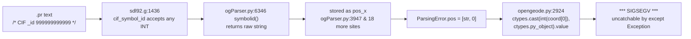

# Security Audit — `opengeode/ogParser.py` (SDL Parser)

**Scope:** parser + its call graph into `opengeode.py`, `Pr.py`, `Clipboard.py`,
`genericSymbols.py`, `TextInteraction.py`, `Asn1scc.py`.
**Method:** pattern sweep (eval/exec/import/subprocess/open/deserialization) →
context read of every hit → **PoC verification of each finding** (all PoCs
below were executed and observed on this machine).
**Companion docs:** `docs/security-audit-asn1scc-cache.md` (the earlier ASN.1
cache audit — its fixes are assumed in place here: sha256 cache keys, by-path
imports, manifest verification).

---

## Summary

| # | Finding | Severity | Status | PoC |
|---|---------|----------|--------|-----|
| P1 | Forged `/* CIF _id N */` → `ctypes.cast` → uncatchable SIGSEGV in GUI | **MAJOR** | **FIXED** | ✅ exit 139, core dump |
| P2 | `{mantissa, base, exponent}` literal → `pow(int, int)` bignum → unbounded CPU/RAM | **MAJOR** | **FIXED** | ✅ 1e9 → 7.3s/512MB; 1e12 → OOM-kill |
| P3 | `sys.path.insert(0, model_dir)` never reverted → lazy-import module hijack | **MAJOR (RCE)** | **FIXED** | ✅ planted `LlvmGenerator.py` executed |
| P4 | SYNTYPE re-declaration cycle → mutual recursion → `RecursionError` crash | **MAJOR** | **FIXED** | ✅ raw traceback, CLI exit 1 |
| P5 | Deeply nested expressions → `RecursionError` in ANTLR tree build | **MAJOR** | **FIXED** | ✅ 2000 parens → traceback, exit 1 |
| P6 | `open()` in error reporter without `encoding=` → reporter crash on legacy locales | **MINOR** | **FIXED** | ✅ `UnicodeDecodeError` under `LC_ALL=C -X utf8=0` |
| P7 | `eval(elem)` at `ogParser.py:8343` — **RCE claim refuted**; assert-gated rule dispatch | **MINOR** | **FIXED** | ✅ `-O`: `getattr` gate blocks payload; valid rule name accepted |
| P8 | Huge STRING literal parsing quadratic? | **NEGATIVE** | refuted | ✅ 1M-digit `int(x, 2)` = 0.00s on Py3.13 |
| P9 | HYPERLINK/_REQSERVER_ CIF keys → URL handlers / requirements server | **MINOR** | **FIXED (hyperlink)** | click-gated |
| P10 | `opengeode.py:3914` asn1scc args lack the leading-`-` filename check | **MINOR** | **FIXED** | parity gap |

**Verified clean (no model→dangerous-sink path):** text-area content dispatch;
synonym/constant values (parsed to AST, never interpreted as Python);
NEWTYPE/`type()` construction (names only, no code); `n7s_scl_*` stubs;
no deserialization anywhere; no `shell=True`/`os.system`/`os.popen` anywhere;
error strings never re-parsed/evaluated; SIZE constraints never pre-allocate;
SEQUENCE OF literal parsing is linear; **no network I/O anywhere in
`opengeode/`**; `RID_SERVER` CIF value is discarded entirely.

> **Remediation status:** all findings above are FIXED. The fixes are
> described in `docs/security-fix-ogparser.md`, with regression tests in
> `tests/pytests/test_ogparser_security.py` (19 tests) and full-suite
> verification. The P2 twin in `LlvmGenerator.py:1559` was removed along
> with the LLVM backend.

---

## P1 — Forged `CIF _id` → `ctypes.cast` → SIGSEGV (MAJOR)

**Data flow**



* The `USE`/`_id` value is only *legitimately* emitted by `Pr.py:222`
  (`id(symbol)`, and only when `use_symbol_id=True` — a live-scene re-parse).
  But the grammar (`sdl92.g:1436-1438`) accepts **any hand-written INT**, so
  any `.pr` file carries a forged id.
* Verified: a probe model with `/* CIF _id 999999999999 */` produces an error
  whose `pos` is `['999999999999', 0]`.
* Verified: `ctypes.cast(999999999999, py_object).value` **dumps core** —
  process exit 139. The handler `except Exception` at `opengeode.py:2933`
  cannot catch SIGSEGV.
* Trigger: the GUI's *check-model* flow (F7 or Ctrl-S / save,
  `opengeode.py:2827 → 2857-2865`) parses the secondary files
  (`files=self.readonly_pr`) — which are plain files on disk — then calls
  `find_symbols_and_update_errors(use_id=True)`, which casts the coordinate.
* Impact: **crash-DoS of the GUI from file content**, plus a theoretical
  arbitrary-object dereference if the attacker can supply a *valid* address
  (then `symbol.ast.path = path` etc. write to an arbitrary object).

**Fix:** reject/ignore `_id` values that are not a live `id()` — e.g. have
`symbolid()` return `None` when parsing from files (`use_symbol_id` is only
ever true for the scene re-parse, so the file path doesn't need ids at all),
or gate the cast behind a registry of live symbol ids.

---

## P2 — `{mantissa, base, exponent}` bignum DoS (MAJOR)

`sdl92.g:1194-1198` accepts `{ mantissa INT, base INT, exponent INT }`
(FLOAT2 token; INT is an unbounded digit run). `ogParser.py:3549-3561`:

```python
mant = float(...)  ; base = int(...)  ; exp = int(...)
value = float(mant * pow(base, exp))     # line 3555
```

`pow(int, int)` is an **exact arbitrary-precision integer computed before**
the `float()` conversion, so `float('1e999') → inf` never gets a chance.
Measured with a one-line `task x := {mantissa 1, base 2, exponent N}`:

| exponent value | wall time | peak RSS | outcome |
|---|---|---|---|
| 1e8 | 2.08 s | 148 MB | `OverflowError` (uncaught — parse aborts) |
| 1e9 | 7.33 s | 512 MB | `OverflowError` |
| 1e12 | killed at 20 s | multi-GB | never completes (timeout-kill) |

~40 bytes of model text buys unbounded CPU + RAM. In the GUI, the expression
parser runs per keystroke (`parseSingleElement('task', text)`), so one pasted
task can wedge the editor. **Same bug** in `LlvmGenerator.py:1559`
(`(mantissa * base) ** exponent` — computed again at codegen).
Contrast: the `power()` *operator* path (`ogParser.py:1121-1130`) uses
`pow(float, float)` and its `OverflowError` **is** caught at `3158-3159` —
that path is fine.

**Fix:** clamp the exponent (reject `|exp| > 1024`), or compute
`float(mant) * float(base) ** float(exp)`; same in LlvmGenerator.

---

## P3 — `sys.path` pollution → lazy-import module hijack (MAJOR, RCE)

* `ogParser.py:8113-8114` — for **every** input file:
  `sys.path.insert(0, os.path.dirname(filename))`, **never reverted**
  (no `sys.path.pop` anywhere in the file).
* `ogParser.py:80` — `sys.path.insert(0, '.')` at import time.
* `opengeode.py:2633` and `:4650` — `os.chdir()` into the model directory
  before parsing, so `.` *is* the model dir too.
* Later lazy imports by absolute name then resolve against the attacker's
  directory **first**:

| lazy import | site | trigger |
|---|---|---|
| `import LlvmGenerator` | opengeode.py:157 | module import (top-level, behind try/ImportError — silently picks the planted file) |
| `import StgBackend` | opengeode.py:163, StgBackend.py:9 | module import / `--stg` |
| `import timeit` | opengeode.py:654 | **first model render** (`render_everything`) — verified `timeit` is *not* pre-imported |
| `import opengeode.AutoRouter` | Connectors.py:83 | autolayout |
| `from collections import Counter` | asn1_editor.py:812/816 | ASN.1 dock (stdlib hijack) |
| `import opengeode.genericSymbols as gs` | opengeode.py:665/729/822 | several UI paths |

**PoC (verified):** model dir containing `evil.pr` plus a planted
`LlvmGenerator.py` whose module body writes a marker file → after
`parse_pr(...)`, a plain `import LlvmGenerator` executed the planted module
(marker file created). Because the import is wrapped in
`except ImportError: pass`, the victim gets *no error at all* — the planted
module simply becomes "the" backend.

Note the asymmetry: the hardened `Asn1scc.py` deliberately imports its
generated modules **by path** (`_import_module_from_source`,
`Asn1scc.py:380-405`) for exactly this reason — the hazard was known there but
never fixed in the parser.

**Fix:** drop the `sys.path.insert` calls (nothing in the parser needs them —
`set_global_DV` uses the hardened by-path import), or pop them in a
`finally`. Convert the lazy imports to package-relative
(`from . import LlvmGenerator`).

---

## P4 — SYNTYPE re-declaration cycle → RecursionError crash (MAJOR)

`USER_DEFINED_TYPES` is updated by `syntype` with **no duplicate-name check**
(`ogParser.py:4549-4569`; the comment at `:4471` claims a check that does not
exist). A second text area can re-point an existing name:

```
syntype A = integer constants 0:1; endsyntype;
syntype B = A     constants 0:1; endsyntype;
syntype A = B     constants 0:1; endsyntype;   -- A → B → A
dcl x A;
```

Direct self-reference is blocked (the referenced type must exist first), so
the cycle needs two/three declarations. Once cycled, `find_basic_type`
(`:742`) and `is_numeric` (`:426`) mutually recurse →
**`RecursionError`**. Verified on the CLI: raw traceback, exit 1, uncaught by
`parse_pr`'s handlers. (An earlier hypothesis of an infinite *loop* was
wrong — the observable is a recursion crash.)

**Fix:** reject re-declaration of an existing type name; add a visited-set to
`find_basic_type`'s ReferenceType walk.

---

## P5 — Unbounded recursion, no depth cap (MAJOR)

* No `sys.setrecursionlimit` and **no `RecursionError` handling anywhere in
  the repo** (grep-verified).
* `check_syntax`'s inner `check` recurses per ANTLR node (`:668-673`); the
  semantic walkers are mutually recursive
  (`expression → primary → expression` for nested SEQOF/CHOICE/SEQUENCE,
  `:2440-2494`, `:3569-3599`); the **generated parser itself** is
  recursive-descent (`sdl92Parser.py:23054` `unary_expression` self-calls).
* **Verified:** `task x := ((((…(1)…))));` with 2000 parens →
  `RecursionError` raised from `antlr3/tree.py:1495` (tree construction),
  CLI `--check` exit 1 with traceback. Cost ≈6-10 Python frames per nesting
  level, so **~100-150 nested parens/decisions suffice** at the default
  limit of 1000.
* GUI paths wrap parse calls in broad `except Exception`, so they degrade to
  an error dialog; the **CLI path (`opengeode.py:4651`) has no handler** →
  raw traceback.

**Fix:** depth counter in `check_syntax`/`expression` (raise a clean
`ParsingError` at e.g. depth 200); catch `RecursionError` in `parse_pr` and
report it as a syntax error.

---

## P6 — Error reporter re-opens the file without an encoding (MINOR)

`ogParser.py:681` — `open(filename, 'r')` inside `check_syntax`'s error
formatting. Under a legacy locale (`LC_ALL=C`, `-X utf8=0`) a model with
non-ASCII bytes **crashes the error reporter itself** with
`UnicodeDecodeError: 'ascii' codec` — verified. The reporter failure masks
the real syntax error (and `parse_pr` only catches `SyntaxError` around it,
so the whole parse aborts). Modern UTF-8-default systems are unaffected
(verified clean under the default locale); latent for CI/headless runs.
`ogParser.py:8377` confirms the ANTLR stream can't take an encoding either —
so the tokenizer and the reporter use **two different decodings** of the same
file.

**Fix:** `open(filename, 'r', encoding='utf-8', errors='replace')` at `:681`
(and keep in mind `:3521` already decodes with `'utf-8'`).

---

## P7 — `eval(elem)` at ogParser.py:8343 (MINOR — RCE claim refuted)

The single `eval` in the parser. Reachability chain:
`Clipboard.paste` (`Clipboard.py:121-143`) reads the **OS clipboard**
(any process on the desktop can write it), splits on `@-@`, and passes field
3 as `elem` → `parseSingleElement`. The whitelist is an **`assert`**
(`:8267-8294`) → stripped under `python -O`.

Verified under `-O`:
* `elem = '__import__("os").system(...)'` → dies earlier at
  `getattr(parser, elem)` (`:8326`) with `AttributeError` — **no RCE**; the
  `getattr` gate accidentally requires `elem` to be a parser-object attribute
  (an identifier).
* `elem = 'process_definition'` (a valid rule *not* in the whitelist) →
  parses fine — the whitelist is the only thing keeping arbitrary rules out.
* Without `-O`: hostile elem → uncaught `AssertionError` per paste
  (crash-noise DoS in the Qt slot).

Fragile-by-design (the safety depends on an invariant two statements away);
same pattern at `genericSymbols.py:267` (`eval(item_type)` over the closed
`_unique_followers` set).

**Fix:** replace `eval(elem)` with an explicit name→function dict; validate
the clipboard `common_name` in `paste()` before calling.

---

## P8 — Huge numeric literals (NEGATIVE — refuted)

* Base-2/16 STRING literals: `int('1'*1_000_000, 2)` → **0.00 s** on this
  Python 3.13 (power-of-2 bases parse linearly). No quadratic blowup.
* Huge base-10 literals: clean `ValueError` (the CVE-2020-10735 int/str
  conversion limit) — a controlled error, not a crash.
* `float('1'*5000)` → `inf`, cheap.
* No `[0]*n` or `range(SIZE)` allocation exists in the parser
  (checked every SIZE-constraint consumer; constraints are only *compared*).

---

## P9 — CIF HYPERLINK / _REQSERVER_ (MINOR)

* `HYPERLINK` → `TextInteraction.py:165-167`:
  `setOpenExternalLinks(True)` + `setHtml(<a href=model-supplied>)` →
  **click-gated** OS URL-handler invocation with a model-controlled scheme.
* `_REQSERVER_` (`ogParser.py:5510` → `genericSymbols.g_url`) → handed to the
  external TASTE requirements plugin (a credential/redirect target;
  `genericSymbols.py:536-537` performs a `.netrc` lookup) — but **no fetch
  at parse time** and **no network code anywhere in `opengeode/`**
  (grep-verified: no `urllib`/`requests`/`socket`).
* `_RIDSERVER_` is parsed and **discarded** (only `Pr.py` writes it back).

---

## P10 — asn1scc argument parity gap (MINOR)

`opengeode.py:3913-3922` (`check_asn1_syntax`, the GUI ASN.1 editor) appends
model-derived `asn1_files` paths to the asn1scc `QProcess` arguments
**without** the leading-`-` filename validation that the hardened
`Asn1scc.py:96-102` (`_validate_input_files`) applies on its own paths.
Exploitable only if an attacker can also plant a dash-prefixed file; a
consistency gap worth closing regardless.

---

## Recommended fix priority

1. **P3** — remove/revert the `sys.path.insert` (parser + line 80) — cheap,
   removes a verified RCE.
2. **P2** — bound the FLOAT2 exponent (`:3555`, LlvmGenerator `:1559`).
3. **P1** — stop trusting file-carried `_id` (symbolid/gate the cast).
4. **P4/P5** — duplicate-name check in `syntype`; depth caps; catch
   `RecursionError` in `parse_pr`.
5. **P7** — dict-lookup instead of `eval`; validate clipboard `elem`.
6. **P6/P10** — encoding= at `:681`; filename validation parity at
   `opengeode.py:3914`.
