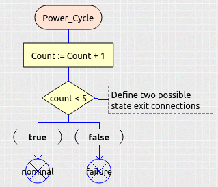

Detailed SDL tutorial
=====================

|OpenGEODE|

Introduction
============

SDL is a rich language and the complete specifications are available on
the ITU-T website : https://www.itu.int/rec/T-REC-Z.100

There are several major revisions of the language:

-  SDL88 - the first public version
-  SDL92 - major update adding object orientation
-  SDL96 - minor update fixing issues of SDL92
-  SDL2000 - major update introducing new concepts (agents, exceptions,
   parallel and nested states)
-  SDL2010 - the baseline of the current version (latest version is from
   2019)

Check https://www.sdl-forum.org for more information.

OpenGEODE supports a subset of the last version of the standard. In this
page we list the features of this subset and explain how to use them.

| 

SDL concepts overview
=====================

These are the main symbols used in a SDL state machine:

|ClipCapIt-221113-172343.PNG|

| 
| State machines in SDL look like flow diagrams and are read vertically.
  This is a typical SDL transition diagram:

|ClipCapIt-210118-094530.PNG|

| 
| We will now go in the details of each symbol.

| 

Start symbol
------------

There are three places in a SDL model where a START symbol can be used:

1. At the state machine root diagram: It is mandatory here. A state
machine has exactly one start transition.

|ClipCapIt-210118-094606.PNG|

| 
| The start transition is executed at process creation

The start transition

- Sets the initial state - May execute initial actions (initialization
of variables)

| 
| 2. Inside procedures. The start symbol has a slightly different shape,
  and is triggered when the procedure is called:

|ClipCapIt-210118-095047.PNG|

| 
| 3. Inside nested states

There can be more than one Start transition in a nested state. In that
case they must be given a name.

|ClipCapIt-210118-095310.PNG|

| 
| The selection of the nested state start transition is done one level
  above, when entering the nested state, using the **via** syntax:

|ClipCapIt-210118-095516.PNG|

State / Nextstate
-----------------

|ClipCapIt-210118-095659.PNG|

-  Each state has a name
-  In a given state, the process is expecting to receive messages
-  A state can be composite

Note the following shortcut that allow to save diagram space:

|ClipCapIt-210118-095756.PNG|

A new state is usually reached at the end of a transition:

|ClipCapIt-210118-100008.PNG|

A shortcut is the history state, that returns to the most recent state.
This is particularly useful when combined with the state shortcuts:

|ClipCapIt-210118-095908.PNG|

If the most recent state was a nested state, re-entering the nested
state means going through its startup transition and possibly executing
its entry procedure.

It is also possible to enter a nested state via one of its internal
startup transition, as seen above using the **via** syntax.

When a state is an aggregation (i.e. containing parallel states) it is
possible to consume a transition at the parent level and return to the
parallel states in the same state they were before the transition. This
is called "history dash", and is achieved using the identifier **-\***
in the next state symbol:

|ClipCapIt-210625-143721.PNG|

Input
-----

|ClipCapIt-210118-100242.PNG|

-  Fires a transition : the transition is executed when the process
   consumes the signal

-  In a given state, the process can expect several signals

-  May have parameters (use variables to store their values)

The following shortcuts are available:

|ClipCapIt-210118-100336.PNG|

-  Inputs at level N have priority over inputs at level N-1 (composite
   states)
-  As a consequence, be careful with « asterisk » inputs : if the state
   is composite, all inner inputs are ignored.

Continuous signals
------------------

Continuous signals are spontaneous transitions that trigger when no
input signal is present (standard input always have priority). They are
boolean expressions:

|ClipCapIt-210118-110747.PNG|

These can be used to perform background tasks, that will be interrupted
as soon as a message is received.

Continuous signal should be mutually exclusive otherwise there is a case
of non-determinism and the order of evaluation is not guaranteed (do not
assume they are evaluated from left to right).

It is possible to use a priority to express the order of evaluation:

|ClipCapIt-220217-204043.PNG|

This will be properly reflected if you generate the code:

|ClipCapIt-220217-204219.PNG|

Connection
----------

A connection is a transition that is executed when leaving a nested
state. It is named in the nested state itself using the exit symbol,
like this:

|ClipCapIt-210118-100713.PNG|

| 
| The connection symbol, one level above, allows to trigger a
  corresponding transition when leaving the state:

|ClipCapIt-210118-100951.PNG|

| 
| *Note*

::

     Nested states also contain optional entry and exit procedures, that are executed in addition to the start transition and to the connection transitions. See below for details.

Output
------

|ClipCapIt-210118-101539.PNG|

Transmission (sending) of a message, with or without a parameter.

*NOTE: only one parameter is supported by TASTE.*

It is also possible to specify the destination of the message if the
system contains multiple connections. The **PID** type contains the list
of system function. The following syntax allows to specify the
recipient:

|ClipCapIt-221016-152351.PNG|

TASK
----

Tasks are elementary actions of a process transition. They can be either
informal:

|ClipCapIt-210118-101729.PNG|

| 
| (use single quotes and free text)

Or formal:

|ClipCapIt-210118-101756.PNG|

| 
| Formal tasks allow to assign values to variables and to execute **for
  loops** to iterate on arrays. It is also possible the manipulate data
  with built-in operators (ternary, math, array concatenation, etc.).
  The details are given on this page:

`Technical topic: OpenGEODE - SDL Operators: How to work with
data <Technical_topic_OpenGEODE_SDL_Operators_How_to_work_with_data.html>`__

Procedure calls
---------------

Procedures can:

-  have in and in/out parameters
-  return a variable
-  be defined locally or externally

The procedure call symbol is for calling procedures that do not return
variables. Parameters, if any, are separated with commas.

|ClipCapIt-210118-103419.PNG|

| 
| There are two special built-in procedures that can be called to write
  strings on screen: **write** and **writeln**. They can take multiple
  parameters separated with commas, for example to display variables of
  basic types. For exmaple:

|ClipCapIt-210118-103741.PNG|

| 
| Procedures that return a value must be called within a TASK symbol
  using this syntax:

|ClipCapIt-210118-104323.PNG|

| 
| There are also built-in procedures for **setting and resetting
  timers**: **set_timer(time_in_ms, timer_name)** and
  **reset_timer(timer_name)**.

If the procedure is remotely call, and if there are more than one
possible callee, it is possible to specify the destination using the
**TO PID** syntax:

|ClipCapIt-221016-152611.PNG|

In the absence of the **TO** clause, all recipients are called in
sequence (multicast). If there are output parameters, they will be
modified by each callee.

Decisions
---------

Like tasks, decisions can be formal or informal. Informal decisions are
useful when building the model, and can be made formal when ready.

Informal decision and their answers are expressed with single quotes:

|ClipCapIt-210118-104654.PNG|

| 
| While formal decisions contain expressions:

|ClipCapIt-210118-104736.PNG|

A decision can have more than two answers, and in that case the answers
must be mutually exclusive. The last answer can be the special kewword
**else**. Decisions can be used to build graphical loops, when used
together with join/labels:

|ClipCapIt-210118-105024.PNG|

| 
| If the expression in the decision is an ENUMERATED variable, the
  decision answers can be the enumerants:

|ClipCapIt-210118-105232.PNG|

| 
| If the expression is the built-in **present** operator for a CHOICE
  type variable, the answers are the possible elements of the union:

| 

|ClipCapIt-210118-105425.PNG|

| 
| There is a special decision in SDL called **decision any** that allows
  to trigger a branch randomly:

|ClipCapIt-210118-111213.PNG|

It is also possible to group answers in convenient ways to limit the
number of branches:

|ClipCapIt-210526-110915.PNG|

|ClipCapIt-210526-111230.PNG|

Labels and branches
-------------------

|ClipCapIt-210118-105459.PNG|

Labels and branches allow re-routing and basic loops. They can be used
to go to a next state from multiple points without repeating common
pre-entry actions (as an alternative to a state **entry** procedure).

Procedures
----------

Overview
~~~~~~~~

|ClipCapIt-210118-105708.PNG|

| 
| Procedure are sequential sub-functions. They can have in and in/out
  parameters and optionally return a value. They have visibility on the
  parent variables. They can contain local variables, but no internal
  state (yet standard SDL allows it).

|ClipCapIt-210118-105905.PNG|

Declaration
~~~~~~~~~~~

The symbol for adding a procedure to the SDL model is the following:

|ClipCapIt-210401-142841.PNG|

If the procedure has parameters, they must be declared inside the
procedure in a text box with the following syntax:

|ClipCapIt-210401-143114.PNG|

Procedures can have special attributes, in which case the declaration of
the procedures have to be done in a text box at a higher level (not in
the procedure itself).

External procedures
~~~~~~~~~~~~~~~~~~~

A procedure can be declared **external**. This means that the definition
of the procedure is not part of the model. When generating code that
implies that the user (or TASTE) provides the code of the procedure and
a symbol for the linker.

|ClipCapIt-210401-143647.PNG|

Referenced procedure
~~~~~~~~~~~~~~~~~~~~

A procedure can be declared at one place of the model, and implemented
(with the graphical symbol) at another place. In that case the
declaration must contain the keyword **referenced**.

|ClipCapIt-210401-143813.PNG|

Exported procedures
~~~~~~~~~~~~~~~~~~~

Exported procedures allow to implement the concept of **remote procedure
calls**. When a procedure is declared as exported, it means that it can
be called synchronously from the environment of the process without an
explicit signal. When targeting the generation of code, this is very
convenient for example to implement getters or setters that can run in
the context of the calling thread and that do not require a pair of
signals for sending back a value.

Exported procedures in SDL are declared like this:

|ClipCapIt-210401-144310.PNG|

They must then be implemented graphically and the procedure content must
contain a text box with the same interface declaration:

|ClipCapIt-210401-144432.PNG|

As you can see in this example the procedure has visibility on the
parameters, but also on the containing process context (dataHasChanged
is a variable declared at process level).

After the execution of the exported procedure, the containing process
will execute an optional transition with the same name as the procedure
(but with no parameters). This allows to change the state of the state
machine if needed. For example:

|ClipCapIt-210401-144924.PNG|

| 
| This does not require a signal declaration, as it is implicit from the
  procedure declaration.

If there is no transition defined, it is also possible to trigger a
transition using continuous signals. For example:

|ClipCapIt-210401-145044.PNG|

Composite states
----------------

OpenGEODE supports both nested and parallel states. Double click on a
state to create a nesting structure.

|ClipCapIt-210118-105936.PNG|

If the neseting structure only contain states but no start transitions,
they are parallel states. Each of them must then be refined and have
their start transitions.

Parallel states can't consume the same signals (signal lists are
disjoint).

A nested state can have multiple entry and exit points, as well as an
entry and exit procedures which are called automatically upon
entering/leaving the nested state.

Nested state entry points
~~~~~~~~~~~~~~~~~~~~~~~~~

Inside a nested state you can define multiple startup transitions. In
that can they must be named:

|ClipCapIt-210325-091559.PNG|

From the state above, you can choose which startup transition you want
to use, using the **via** clause:

|ClipCapIt-210325-091648.PNG|

| 
| You can add an unnamed startup symbol for the default entry without a
  **via** clause.

Nested state exit transitions
~~~~~~~~~~~~~~~~~~~~~~~~~~~~~

Similar to the the startup transition you can define named exit:

|ClipCapIt-210325-091847.PNG|

| 
| In the level above, use the CONNECT symbol :

|ClipCapIt-210325-092002.PNG|

and specify the exit labels you defined inside the state:

|ClipCapIt-210325-091951.PNG|

entry and exit procedures
~~~~~~~~~~~~~~~~~~~~~~~~~

Inside a nested state you can define a procedure with the special names
**entry** and **exit**

|ClipCapIt-210325-092203.PNG|

These procedures will be called automatically when the state is entered
or left, from all defined paths.

Alternative
-----------

The alternative symbol allows to define compilation options, similar to
the #ifdef directive in C. A boolean constant will be evaluated and only
one branch will be kept at code generation level. This is useful to
create parameterized models, where context parameters can be used to
decide if some code has to be generated or not. This provides a good way
to optimize code.

Consider this example:

|ClipCapIt-221113-174957.PNG|

Assuming the following constants defined in the ASN.1 model:

|ClipCapIt-221113-175042.PNG|

A code generator shall only keep the branches with the answer evaluating
to the value of the constants. The OpenGEODE Ada code generator will
generate in this example the following code:

|ClipCapIt-221113-175250.PNG|

Only a single boolean constant is allowed in the alternative symbol, and
the answers therefore need to be true and false (or "else"). The
constant can be declared in ASN.1 or as a synonym in the SDL model, like
this:

|ClipCapIt-221113-175556.PNG|

SDL Textual grammar
-------------------

SDL is both a graphical **and** a textual language. OpenGEODE's SDL
grammar is defined here:

https://github.com/esa/opengeode/blob/master/sdl92.g

SDL in the context of TASTE
===========================

One important features of SDL is the possibility to describe a system
made of components that communicate through messages. This description
can be nested: a block can contain other blocks that eventually contain
actual state machines.

This is not directly supported by OpenGEODE because it is done in TASTE
(graphically and textually) using the AADL language.

**The semantics are nearly similar**, with the following differences:

1. **SDL does not allow to specify a cyclic message in this view
(periodic activation has to be done using timers inside state
machines)**

However TASTE allows it in the Interface View:

|ClipCapIt-210118-083557.PNG|

| 
| In this example, the interface named "monitor" is cyclic. A period has
  to be specified for it.

2. **In regular SDL all messages are asynchronous**. Direct function
calls are possible between two state machines (remote procedure calls)
but this communication is hidden from the diagram.

In TASTE, synchronous calls are expressed in the Interface View to
expose the remote procedure calls from SDL to an external function.

|ClipCapIt-210118-084101.PNG|

Synchronous calls are immediately executed (blocking calls) and can be
either protected (mutual exclusion between messages) or unprotected
(executed immediately no matter what).

TASTE supports synchronous interfaces:

-  Synchronous provided interfaces are implemented using the declaration
   of **exported procedures**.
-  Synchronous required interfaces are implemented using the declaration
   of **external procedures**.

Both constructs are part of the SDL standard.

| 
| 3. **In SDL all active functions are state machines**

In TASTE it is possible to implement them in different languages: SDL,
but also Simulink, C, C++, Ada, and even VHDL. TASTE generates the glue
code between the functions.

| 
| 4. **SDL allows to specify multiple parameters associated to
  asynchronous signals**.

In TASTE however, it is possible to have only one parameter in
asynchronous interfaces (one signal = one message). Synchronous
interfaces support multiple in or in/out signals and are supported by
TASTE and OpenGEODE.

| 
| 5. **The SDL standard comes with two ways to describe data types: a
  legacy (yet very powerful) type system, and ASN.1** TASTE only
  supports a very small subset of the legacy SDL type system, and relies
  on ASN.1 instead. ASN.1 is an international standard (ISO and ITU-T),
  supported by multiple tools and used in lots of applications. It is
  therefore recommended to use it instead of the built-in SDL syntax for
  data types.

Index
=====

.. container:: toc
   :name: toc

   .. container:: toctitle
      :name: toctitle

      .. rubric:: Contents
         :name: contents

   -  `1 Introduction <#Introduction>`__
   -  `2 SDL concepts overview <#SDL_concepts_overview>`__

      -  `2.1 Start symbol <#Start_symbol>`__
      -  `2.2 State / Nextstate <#State_.2F_Nextstate>`__
      -  `2.3 Input <#Input>`__
      -  `2.4 Continuous signals <#Continuous_signals>`__
      -  `2.5 Connection <#Connection>`__
      -  `2.6 Output <#Output>`__
      -  `2.7 TASK <#TASK>`__
      -  `2.8 Procedure calls <#Procedure_calls>`__
      -  `2.9 Decisions <#Decisions>`__
      -  `2.10 Labels and branches <#Labels_and_branches>`__
      -  `2.11 Procedures <#Procedures>`__

         -  `2.11.1 Overview <#Overview>`__
         -  `2.11.2 Declaration <#Declaration>`__
         -  `2.11.3 External procedures <#External_procedures>`__
         -  `2.11.4 Referenced procedure <#Referenced_procedure>`__
         -  `2.11.5 Exported procedures <#Exported_procedures>`__

      -  `2.12 Composite states <#Composite_states>`__

         -  `2.12.1 Nested state entry
            points <#Nested_state_entry_points>`__
         -  `2.12.2 Nested state exit
            transitions <#Nested_state_exit_transitions>`__
         -  `2.12.3 entry and exit
            procedures <#entry_and_exit_procedures>`__

      -  `2.13 Alternative <#Alternative>`__
      -  `2.14 SDL Textual grammar <#SDL_Textual_grammar>`__

   -  `3 SDL in the context of TASTE <#SDL_in_the_context_of_TASTE>`__
   -  `4 Index <#Index>`__

.. |ClipCapIt-221113-172343.PNG| image:: img/400px-ClipCapIt-221113-172343.PNG
   :width: 400px
   :height: 471px
   :target: img/ClipCapIt-221113-172343.PNG

.. |ClipCapIt-210118-100008.PNG| image:: img/100px-ClipCapIt-210118-100008.PNG
   :width: 100px
   :height: 108px
   :target: img/ClipCapIt-210118-100008.PNG

.. |ClipCapIt-210118-100336.PNG| image:: img/ClipCapIt-210118-100336.PNG
   :width: 497px
   :height: 237px
   :target: img/ClipCapIt-210118-100336.PNG

.. |ClipCapIt-210118-104654.PNG| image:: img/ClipCapIt-210118-104654.PNG
   :width: 248px
   :height: 223px
   :target: img/ClipCapIt-210118-104654.PNG

.. |ClipCapIt-210118-105024.PNG| image:: img/ClipCapIt-210118-105024.PNG
   :width: 269px
   :height: 276px
   :target: img/ClipCapIt-210118-105024.PNG

.. |ClipCapIt-210401-143114.PNG| image:: img/ClipCapIt-210401-143114.PNG
   :width: 341px
   :height: 160px
   :target: img/ClipCapIt-210401-143114.PNG

.. |ClipCapIt-210118-083557.PNG| image:: img/ClipCapIt-210118-083557.PNG
   :width: 364px
   :height: 194px
   :target: img/ClipCapIt-210118-083557.PNG

