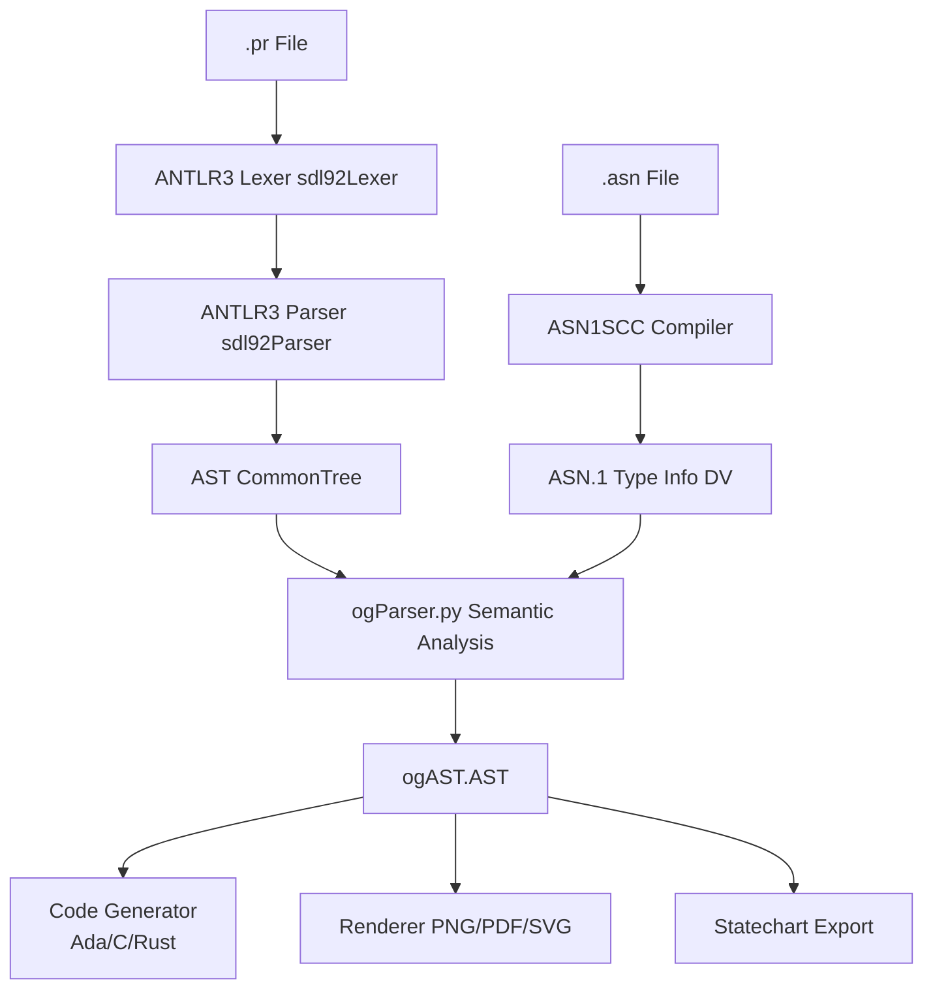
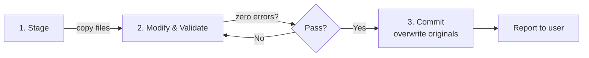
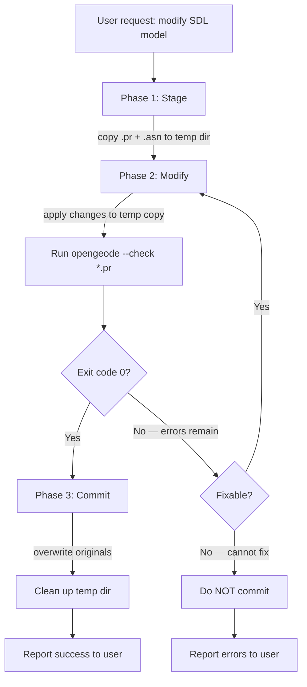
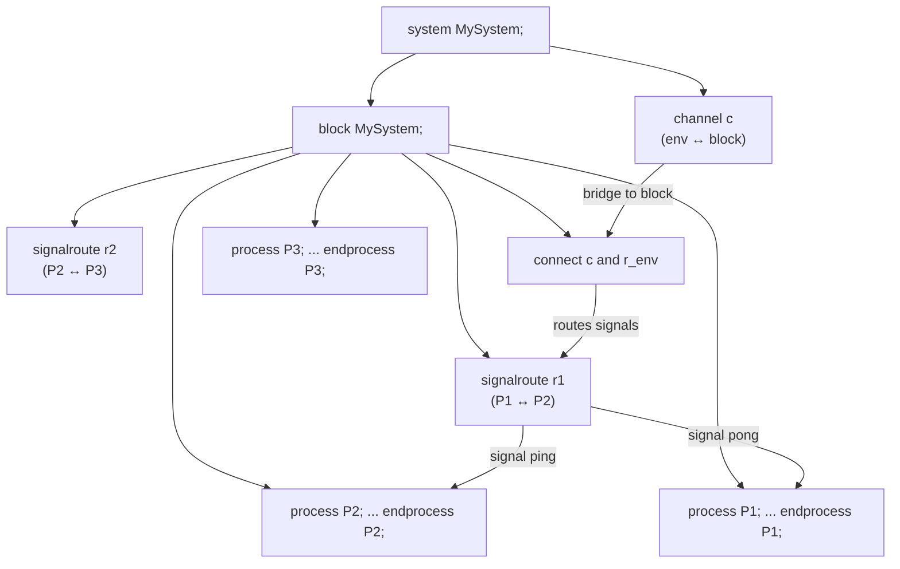
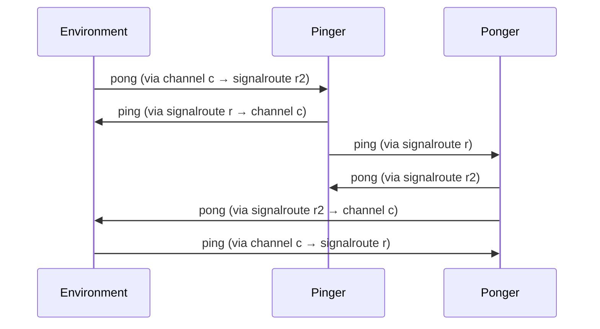
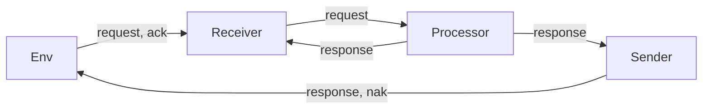

# OpenGEODE SDL Model Construction — Skill Documentation

> **Purpose**: This document provides comprehensive guidance for constructing
> syntactically and semantically correct SDL (Specification and Description Language)
> models for use with the OpenGEODE tool. It is derived from deep analysis of the
> ANTLR3 grammar (`sdl92.g`), the semantic parser (`ogParser.py`), the command-line
> interface (`opengeode.py`), the complete test suite, and the official
> documentation (tutorial, wiki, operator reference).

---

## Table of Contents

1. [SDL Language Overview](#1-sdl-language-overview)
2. [File Structure and Organisation](#2-file-structure-and-organisation)
3. [Command-Line Interface](#3-command-line-interface)
4. [System Definition](#4-system-definition)
5. [Block Definition](#5-block-definition)
6. [Process Definition](#6-process-definition)
7. [Text Areas and Declarations](#7-text-areas-and-declarations)
8. [States and State Machine Structure](#8-states-and-state-machine-structure)
9. [Transitions and Actions](#9-transitions-and-actions)
10. [Task and Assignment](#10-task-and-assignment)
11. [Output](#11-output)
12. [Decision](#12-decision)
13. [Procedure Call](#13-procedure-call)
14. [Procedures](#14-procedures)
15. [Timers](#15-timers)
16. [Labels, Joins, and Connectors](#16-labels-joins-and-connectors)
17. [Terminators: NextState, Join, Stop, Return](#17-terminators-nextstate-join-stop-return)
18. [Composite States (Nested and Parallel)](#18-composite-states-nested-and-parallel)
19. [Alternative (Compile-Time Conditional)](#19-alternative-compile-time-conditional)
20. [Type System: ASN.1 Integration](#20-type-system-asn1-integration)
21. [SDL Native Type Definitions](#21-sdl-native-type-definitions)
22. [Expression Reference (Operator Precedence and Syntax)](#22-expression-reference-operator-precedence-and-syntax)
23. [Built-in Operators and Procedures](#23-built-in-operators-and-procedures)
24. [CIF Annotations and Pragmas](#24-cif-annotations-and-pragmas)
25. [Semantic Rules and Validation Checklist](#25-semantic-rules-and-validation-checklist)
26. [Common Errors and How to Avoid Them](#26-common-errors-and-how-to-avoid-them)
27. [Complete Worked Examples](#27-complete-worked-examples)
28. [Quick Reference Card](#28-quick-reference-card)
29. [Agent Operating Instructions](#29-agent-operating-instructions)
30. [Multi-Process Systems and Inter-Process Communication](#30-multi-process-systems-and-inter-process-communication)

---

## 1. SDL Language Overview

SDL (Specification and Description Language) is an ITU-T standard (Z.100) for
formally describing the behaviour of real-time, distributed, and embedded
systems. SDL is both a **graphical** and **textual** language — every graphical
symbol has a precise textual representation stored in `.pr` files.

### SDL Versions

| Version | Year | Key Features |
|---------|------|-------------|
| SDL88   | 1988 | First public version |
| SDL92   | 1992 | Object orientation |
| SDL96   | 1996 | Minor fixes to SDL92 |
| SDL2000 | 2000 | Agents, exceptions, parallel/nested states |
| SDL2010 | 2010 | Baseline of current version (latest 2019) |

OpenGEODE supports a **subset of SDL2010** that is sufficient for developing
real-time applications. The ANTLR3 grammar file `sdl92.g` defines the complete
syntax. Key supported features include:

- Process-level state machines with states, transitions, inputs, outputs
- Procedures (local, external, exported, referenced)
- Timers (via `set_timer` / `reset_timer` procedure calls)
- FOR loops in TASK symbols (SDL extension)
- Composite states: nested (sequential) and aggregation (parallel)
- ASN.1 data types (recommended) and limited SDL native types
- Decisions with ranges, enumerations, CHOICE present, and ANY
- Continuous signals (PROVIDED conditions)
- Labels and joins for re-routing and loops
- Ternary conditional expressions (`if-then-else-fi`)

### Features NOT Supported

- The SAVE symbol (use design patterns to emulate it)
- Enabling conditions on inputs (PROVIDED on continuous signals is supported)
- States inside procedures
- Macros
- SDL data types as full replacement (use ASN.1 instead)
- Signallists (partially — the syntax parses but is not used)
- Multiple parameters on asynchronous signals (TASTE limitation: one parameter max)

### Case Insensitivity

The entire grammar is **case-insensitive**. All keywords (PROCESS, STATE, INPUT,
etc.) are defined with case-insensitive fragment rules (e.g., `PROCESS : P R O C
E S S` where `P:('p'|'P')`). Signal names, state names, variable names, and type
names are all matched case-insensitively. ASN.1 type names with hyphens are
normalised: `My-OctStr` in ASN.1 matches `my_octStr` in the .pr file (hyphen ↔
underscore, case-insensitive).



---

## 2. File Structure and Organisation

An OpenGEODE SDL model consists of one or more `.pr` files plus one or more
`.asn` (ASN.1) files. There are two common file organisations:

### Pattern 1: Combined File (Single File)

Everything — system, block, and process — in one `.pr` file:

```
my_model.pr          ← system + block + process (all in one)
my_model.asn         ← ASN.1 type definitions
```

### Pattern 2: Split Files (TASTE Convention)

```
system_structure.pr  ← system + block + signal declarations + process reference
my_process.pr        ← process definition only
dataview-uniq.asn    ← ASN.1 type definitions
```

### Top-Level Grammar Rule

The grammar's top-level rule (`pr_file`) accepts any combination of:

```
pr_file ::= (use_clause | system_definition | process_definition)+
```

This means a `.pr` file can contain:
- A `USE` clause (importing ASN.1 modules)
- A complete `SYSTEM ... ENDSYSTEM` definition (containing blocks and processes)
- A standalone `PROCESS ... ENDPROCESS` definition (split from system structure)

### File Content Anatomy

A typical combined `.pr` file:

```
/* CIF Keep Specific Geode ASNFilename 'dataview-uniq.asn' */
use Datamodel;

system MySystem;

    /* CIF TEXT (159, 221), (290, 200) */
    -- Text area for declarations and comments
    signal go(TypeA);
    signal rezult(TypeB);
    /* CIF ENDTEXT */

    channel c
        from env to MySystem with go;
        from MySystem to env with rezult;
    endchannel;

    block MySystem;
        signalroute r
            from env to MySystem with go;
            from MySystem to env with rezult;
        connect c and r;

        /* CIF PROCESS (225, 49), (150, 75) */
        process MySystem;
            /* CIF TEXT (57, 58), (290, 140) */
            -- Text area for declarations and comments
            dcl counter MyInteger := 0;
            /* CIF ENDTEXT */

            /* CIF START (155, 216), (70, 35) */
            START;
                /* CIF NEXTSTATE (155, 266), (70, 35) */
                NEXTSTATE Wait;

            /* CIF state (155, 266), (70, 35) */
            state Wait;
                /* CIF input (155, 321), (84, 35) */
                input go(msg);
                    task counter := counter + 1;
                    /* CIF NEXTSTATE (155, 371), (70, 35) */
                    NEXTSTATE Wait;
            endstate;
        endprocess MySystem;
    endblock;
endsystem;
```

### Comments

Two forms of comments are supported:

1. **Line comments**: `--` (double dash) — everything until end of line is hidden
   from the parser. Used inside text areas for notes and for separating
   declarations.

2. **Inline comments**: `comment 'text';` — attached to a specific symbol via the
   CIF `end` rule. Example: `output we(test) comment 'check that local vars work';`

3. **CIF annotations**: `/* CIF ... */` — not comments in the traditional sense;
   they carry graphical positioning and tool-specific pragmas (see §24).

---

## 3. Command-Line Interface

OpenGEODE is invoked as `opengeode [options] file.pr [file2.pr ...]`.

### Default Behaviour

With no flags: opens the **graphical editor** (GUI mode).

### Flags

| Flag | Mode | Description |
|------|------|-------------|
| `-v, --version` | — | Print version and exit |
| `-g, --debug` | any | Enable debug logging (verbose) |
| `-e, --edit` | GUI | Open the editor. Combine with `--toC`, `--toAda`, `--toRust` to also generate code on save |
| `--check` | CLI | Check `.pr` file for syntax and semantics only |
| `--toAda` | CLI | Generate Ada code |
| `--toC` | CLI | Generate C code |
| `--toRust` | CLI | Generate Rust code |
| `--simu` | CLI | Generate Ada code with TASTE simulation wrapper |
| `--stg <file>` | CLI | Generate code using a custom String Template file |
| `-O <0-3>` | CLI | Set optimization level for the generated C code |
| `--png` | CLI | Export process diagram to PNG |
| `--pdf` | CLI | Export process diagram to PDF |
| `--svg` | CLI | Export process diagram to SVG |
| `--split` | CLI | Save each floating item as a separate image |
| `--readonly` | GUI | Open diagram as read-only |
| `--taste` | CLI/GUI | Generate code for TASTE targets (output to `../code`) |
| `--dumpAST` | CLI | Dump the parsed AST to file `ast.dump` |
| `files` | — | One or more `.pr` files (positional, nargs='*') |

### CLI Mode vs GUI Mode

CLI mode is triggered when any of `--check`, `--toAda`, `--toC`, `--toRust`,
`--simu`, `--stg`, `--png`, `--pdf`, `--svg`, `--dumpAST` is set **and**
`--edit` is NOT set. In CLI mode, the tool:

1. Parses all `.pr` files
2. Performs semantic analysis
3. Reports errors/warnings
4. If no errors: generates code or exports diagrams as requested

**CLI mode requires exactly 1 process definition.** GUI mode can handle
multiple processes.

### Typical Commands

```bash
# Syntax + semantic check only
opengeode --check model.pr

# Generate Ada code (pass all .pr files)
opengeode --toAda system_structure.pr process.pr

# Generate C code
opengeode --toC system_structure.pr process.pr

# Generate Rust code
opengeode --toRust system_structure.pr process.pr

# Export SVG diagram
opengeode --svg model.pr

# Open GUI editor (default)
opengeode model.pr

# Open GUI + generate Ada on save
opengeode --edit --toAda model.pr
```

### Invalid Combinations

`--edit` can only be combined with `--toC`, `--toAda`, or `--toRust`. Combining
`--edit` with `--check`, `--png`, `--pdf`, `--svg`, `--simu`, `--stg`, or
`--dumpAST` triggers an error and falls back to CLI mode.

---

## 4. System Definition

A SYSTEM is the top-level container. It declares signals, channels, blocks,
and (optionally) external procedures. The system name is used in channel
definitions and block definitions.

### Grammar

```
system_definition:
    SYSTEM system_name end
    entity_in_system*
    ENDSYSTEM system_name? end
```

### Syntax

```sdl
system MySystem;
    -- entity_in_system items (signals, text areas, procedures, channels, blocks)
endsystem;
```

### Entities in a System

| Entity | Description |
|--------|-------------|
| `signal_declaration` | Declare signals with optional type parameters |
| `text_area` | Text zone containing USE clauses, signals, procedures |
| `procedure` | External or referenced procedures at system level |
| `channel` | Communication path between ENV and blocks/processes |
| `block_definition` | A block containing signalroutes and processes |

### Signal Declaration

```sdl
-- Signal with one typed parameter (TASTE: max one parameter)
SIGNAL go(MyInteger);

-- Signal with named parameter (CIF pragma for code generation)
/* CIF Keep Specific Geode PARAMNAMES x_in */
SIGNAL impulse(MyInteger);

-- Signal with no parameter
SIGNAL heartbeat;

-- Signal with RENAMES (for observers only)
SIGNAL observed_input RENAMES input msg from env;
```

**Rules:**
- Signals are declared at **system level** (not inside a process)
- One parameter maximum in TASTE (SDL allows multiple, but TASTE limits it)
- Signal names are case-insensitive
- PARAMNAMES CIF pragma names the parameter for code generation (Ada/C signatures)

### Text Areas in a System

Text areas at system level can contain:

```sdl
/* CIF TEXT (159, 221), (290, 200) */
-- Text area for declarations and comments
USE Datamodel COMMENT 'dataview-uniq.asn';
SIGNAL go(TypeA);
SIGNAL rezult(TypeB);

-- External procedure at system level
procedure myExternProc;
fpar in/out a_param Type2;
external;
/* CIF ENDTEXT */
```

---

## 5. Block Definition

A BLOCK sits inside a SYSTEM and contains signalroutes, connections, and
process definitions. It bridges channels to processes.

### Grammar

```
block_definition:
    BLOCK block_id end
    entity_in_block*
    ENDBLOCK end
```

### Syntax

```sdl
block MySystem;
    signalroute r
        from env to MySystem with go;
        from MySystem to env with rezult;
    connect c and r;
    process MySystem;
        -- process body
    endprocess MySystem;
endblock;
```

### Entities in a Block

| Entity | Description |
|--------|-------------|
| `signal_declaration` | Local signal declarations (rarely used here) |
| `signalroute` | Internal signal routing between env and processes |
| `connection` | Connect a channel to a signalroute |
| `block_definition` | Nested blocks (recursive) |
| `process_definition` | A process (REFERENCED or inline) |

### Signalroute

```sdl
signalroute r
    from env to MyProcess with go;
    from MyProcess to env with rezult;
```

A signalroute defines the actual signal flow inside a block. The `route` entries
specify `FROM source TO destination WITH signal_list`.

### Connection

```sdl
connect c and r;
```

Connects a channel `c` (defined at system level) to a signalroute `r` (defined
in the block). This bridges external communication to internal routing.

### Process Reference (Split Files)

When using the split-file pattern, the system/block file references the process:

```sdl
process MyProcess REFERENCED;
```

The actual process body is defined in a separate `.pr` file that is passed on
the command line.

---

## 6. Process Definition

A PROCESS defines a state machine. It is the core of an SDL model.

### Grammar

```
process_definition:
    cif*
    PROCESS [TYPE] process_id
    [number_of_instances] [':' type_inst] [REFERENCED]
    end
    [pfpar]
    (text_area | procedure | composite_state)*
    processBody?
    [ENDPROCESS] [TYPE] [process_id]
    end?
```

### Syntax Variants

**Inline process (inside a system/block):**
```sdl
process MyProcess;
    -- text areas, procedures, states
endprocess MyProcess;
```

**Referenced process (in system_structure.pr):**
```sdl
process MyProcess REFERENCED;
```

**Process type (can be instantiated):**
```sdl
process TYPE MyProcessType;
    -- body
endprocess TYPE MyProcessType;
```

**Process instance of a type:**
```sdl
process MyInstance: MyProcessType;
    -- body (optional, uses type's body if not provided)
endprocess;
```

**Process with number of instances:**
```sdl
process MyProcess (1, 10);
    -- min_instances=1, max_instances=10
endprocess;
```

### Process Formal Parameters (PFPAR)

Process-level parameters are declared with `FPAR`:

```sdl
process MyProcess;
    fpar param1 TypeA, param2 TypeB;
    -- states and transitions
endprocess;
```

The `pfpar` rule supports multiple parameters of different sorts:
```
pfpar: FPAR parameters_of_sort (',' parameters_of_sort)*
parameters_of_sort: variable_id (',' variable_id)* sort
```

### Process Body

```
processBody: start? (state | floating_label)*
```

The process body consists of:
1. A mandatory **START** transition (unless REFERENCED)
2. Zero or more **STATE** definitions
3. Zero or more **FLOATING_LABEL** definitions

### Implicit Variables

OpenGEODE automatically creates these implicit variables in every process:

- `self` — PID constant of the current process (type PID)
- `sender` — PID of the sender of the last message (type PID)
- `offspring` — PID (if PID type is defined)
- `parent` — PID (if PID type is defined)

The `STATE` keyword can also be used as a primary expression to reference the
current state name.

### Mandatory START

Every non-referenced process **must** have a START transition. If missing, the
parser raises: *"Mandatory START transition is missing in process X"*

---

## 7. Text Areas and Declarations

Text areas are CIF-delimited zones containing textual declarations. They
appear at the system level, process level, and procedure level.

### Grammar

```
text_area: cif+ content? cif_end_text
```

### Syntax

```sdl
/* CIF TEXT (57, 58), (290, 140) */
-- Text area for declarations and comments
dcl counter MyInteger := 0;
dcl name IA5String;
timer myTimer;
/* CIF ENDTEXT */
```

Text areas are opened with `/* CIF TEXT ... */` and closed with `/* CIF ENDTEXT
*/`. Inside, you can write:

- Variable declarations (`DCL`)
- Timer declarations (`timer`)
- Type declarations (`SYNTYPE`, `NEWTYPE`)
- Synonym/constant declarations (`SYNONYM`)
- USE clauses (`USE Module COMMENT 'file.asn';`)
- Signal declarations (only at system level — error if in process)
- Procedure declarations (signature only)
- Procedure formal parameters (`FPAR`)
- Monitor declarations (`MONITOR` — for observers)
- Observer state declarations (`ERRORSTATES`, `IGNORESTATES`, `SUCCESSSTATES`)

### Variable Declaration (DCL)

```sdl
-- Single variable, no initialization
dcl counter MyInteger;

-- Single variable with initialization
dcl counter MyInteger := 0;

-- Multiple variables, same type, no initialization
dcl a, b, c MyInteger;

-- Multiple variables, same type, with initialization
dcl seq MySeqOf := { true, false };

-- Variable with RENAMES alias (SDL extension)
dcl alias_field MyType renames record.subfield;
```

### Timer Declaration

```sdl
timer myTimer;
timer timer1, timer2;
```

Timers are used with `set_timer(ms, timer_name)` and `reset_timer(timer_name)`.
When a timer expires, it triggers an `input timer_name;` transition.

---

## 8. States and State Machine Structure

### State Definition

```sdl
/* CIF state (155, 266), (70, 35) */
state Wait;
    /* CIF input (155, 321), (84, 35) */
    input go(msg);
        -- transition body
        NEXTSTATE Wait;
endstate;
```

### Multiple States Sharing Transitions

Multiple state names can be comma-separated — they share the same transitions:

```sdl
state State_A, State_B, State_C;
    input go;
        -- applies to all three states
        NEXTSTATE Done;
endstate;
```

### Asterisk State

An asterisk `*` state catches all states not explicitly defined. It can exclude
specific states:

```sdl
-- All states except StateA and StateB
state * (StateA, StateB);
    input heartbeat;
        NEXTSTATE -;
endstate;
```

**Important**: In composite (nested) states, asterisk inputs at level N have
priority over level N-1. Be careful: if the state is composite, an asterisk
input will shadow all inner inputs.

### State Instance (Composite State)

A state can be an instance of a composite state type:

```sdl
state MySubstate: CompositeType;
    -- this state uses the behavior of CompositeType
endstate;
```

### State Parts

Inside a state definition, the following parts can appear:

| Part | Description |
|------|-------------|
| `input_part` | Input signal triggering a transition |
| `spontaneous_transition` | `INPUT NONE` — fires without a signal |
| `continuous_signal` | `PROVIDED expr` — fires when condition is true |
| `connect_part` | CONNECT for composite state exit points |

### Input Part

```sdl
-- Basic input with parameter
input go(msg);
    -- transition

-- Input with enabling condition (SDL standard, limited support)
input go(msg) PROVIDED x > 0;
    -- transition

-- Asterisk input (catches all unspecified signals)
input *;
    -- transition

-- Multiple signals
input go, pulse, heartbeat;
    -- transition (fires for any of these signals)
```

### Spontaneous Transition (INPUT NONE)

```sdl
INPUT NONE;
    -- fires spontaneously (no signal needed)
```

### Continuous Signal (PROVIDED)

```sdl
PROVIDED x > 42;
    -- fires when condition is true AND no input signal is present
```

With priority:

```sdl
PROVIDED x > 42 PRIORITY 1;
PROVIDED y > 10 PRIORITY 2;
```

Continuous signals have **lower priority** than input signals. They are
evaluated when no input is available. Use PRIORITY to order evaluation when
multiple conditions are true.

**Warning**: Continuous signals should be mutually exclusive. If overlapping
conditions exist, the evaluation order is not guaranteed.

---

## 9. Transitions and Actions

### Transition Structure

A transition is a sequence of actions followed by an optional terminator:

```
transition: action+ label? terminator_statement? | terminator | label
```

### Action Types

| Action | Syntax | Description |
|--------|--------|-------------|
| Task | `TASK ...;` | Assignment or informal text |
| Output | `OUTPUT sig(params);` | Send a signal |
| Procedure call | `CALL proc(params);` | Call a void procedure |
| Decision | `DECISION ... ENDDECISION;` | Branch on condition |
| Alternative | `ALTERNATIVE ... ENDALTERNATIVE;` | Compile-time conditional |
| Create | `CREATE process(params);` | Create process instance |

### Labels in Transitions

A label can appear within a transition:

```sdl
myLabel:
    task x := 5;
```

Labels allow re-routing via JOIN (see §16).

---

## 10. Task and Assignment

### Formal Task (Assignment)

```sdl
-- Simple assignment
task counter := counter + 1;

-- Multiple assignments in one task
task x := 5, y := 10;

-- Assignment with expression
task result := abs(x) + power(y, 2);

-- Assignment with ternary
task status := if x > 0 then 1 else 0 fi;

-- String concatenation
task msg := msg // '!!';

-- Substring assignment (fixed-length strings only)
task sub := myStr(1, 3);
```

### Informal Task

```sdl
task 'This is informal text describing intent';
```

Informal tasks use single quotes. They are not code-generated but serve as
documentation.

### FOR Loop in TASK

```sdl
task for each in mySeqOf:
    call writeln(each);
    each := each + 1
endfor;
```

### FOR with RANGE

```sdl
-- Range(stop) — 0 to stop-1
task for i in range(10):
    call writeln(i);
endfor;

-- Range(start, stop) — start to stop-1
task for i in range(1, 5):
    call writeln(i);
endfor;

-- Range(start, stop, step)
task for i in range(0, 20, 2):
    call writeln(i);
endfor;
```

**Important**: Range semantics match Python — the stop value is **excluded**.
`range(4)` yields 0, 1, 2, 3.

### Assignment Semicolons

Within a FOR loop body:
- Simple assignments do NOT need a semicolon at end of line
- Statements using SDL keywords (task, output, decision, call) DO need
  semicolons

```sdl
task for each in foo:
    x := x + each     -- no semicolon needed
    y := y + 1        -- no semicolon needed
    task z := 5;      -- semicolon needed because 'task' keyword used
    output msg(each);  -- semicolon needed
endfor;
```

### Assignment Rules

- Left side must be a writable variable (not an IN fpar, not a loop variable)
- Type of right side must be compatible with left side
- Range checking is performed: `task x := y + 1` will error if the result can
  exceed x's declared range

---

## 11. Output

The OUTPUT symbol sends a signal to the environment or another process.

### Syntax

```sdl
-- Output without parameter
output heartbeat;

-- Output with one parameter
output rezult(msg);

-- Output with variable as parameter
output rezult(counter);

-- Output with constant as parameter
output rezult('hello');

-- Output with expression
output rezult(counter + 1);

-- Multiple outputs in one symbol
output go(val), pulse;

-- Output with destination (TO)
output rezult(val) TO self;
output rezult(val) TO otherProcess;
```

### Rules

- Only one parameter per signal in TASTE (SDL allows more, TASTE limits to 1)
- The parameter type must match the signal's declared type
- `TO` clause specifies the destination PID when multiple recipients exist
- Without `TO`, all recipients are called in sequence (multicast)

---

## 12. Decision

Decisions branch the flow based on a question (expression, enumeration, or
CHOICE determinant). They are the SDL equivalent of switch-case.

### Grammar

```
decision: DECISION question answer_part* [else_part] ENDDECISION
question: expression | ANY | informal_text
answer: range_condition | informal_text
range_condition: closed_range | open_range
    closed_range: expr ':' expr
    open_range: constant | (op constant)
```

### Decision on Expression

```sdl
decision tmp;
    (0):
        task result := 1;
        NEXTSTATE Wait;
    (1, 2):
        task result := 2;
        NEXTSTATE Wait;
    (10:15):
        -- closed range 10 to 15
        task result := 3;
        NEXTSTATE Wait;
    (20:30, 60:70):
        -- multiple ranges
        task result := 4;
        NEXTSTATE Wait;
    else:
        task result := 5;
        NEXTSTATE Wait;
enddecision;
```

### Decision with Relational Operators

```sdl
decision x;
    (>0):   -- x > 0
    (=0):   -- x = 0
    (<0):   -- x < 0
    else:
enddecision;
```

Supported operators in answers: `=`, `/=`, `>`, `>=`, `<`, `<=`

### Decision on Boolean

```sdl
decision x > 0;
    (TRUE):
        -- do something
    (FALSE):
        -- do something else
enddecision;
```

**Boolean decisions must have exactly 2 answers** (TRUE/FALSE). Using `else` is
allowed as the FALSE branch.

### Decision on ENUMERATED

```sdl
decision myEnum;
    (foo):
        -- when myEnum = foo
    (bar):
        -- when myEnum = bar
    else:
        -- any other value
enddecision;
```

### Decision on present(CHOICE)

```sdl
decision present(myChoice);
    (a):
        -- when current choice element is 'a'
    (b):
        -- when current choice element is 'b'
    else:
enddecision;
```

### Decision ANY (Random)

```sdl
decision ANY;
    (1):  task x := 1;
    (2):  task x := 2;
    (3):  task x := 3;
enddecision;
```

`ANY` randomly selects one branch. All branches must cover the full type range.

### Informal Decision

```sdl
decision 'should we retry?';
    ('yes'):
        -- retry
    ('no'):
        -- give up
enddecision;
```

### Grouping Answers

Multiple answers can share the same transition:

```sdl
decision myEnum;
    (foo, bar):
        -- shared transition for foo and bar
    (baz):
        -- separate for baz
enddecision;
```

### Range Overlap Checking

The parser checks for overlapping answer ranges and unreachable branches:

```sdl
-- This will produce errors:
decision x;  -- x is INTEGER(0..255)
    (=0):     ...
    (/=1):    ...  -- ERROR: overlaps with =0
    (>0):     ...  -- ERROR: overlaps with /=1
    (-500:500): ...  -- ERROR: overlaps with =0 and >0
enddecision;
```

The parser also warns about unreachable branches (outside the type's range) and
errors about uncovered ranges.

---

## 13. Procedure Call

The `CALL` symbol invokes a procedure that does not return a value.

### Syntax

```sdl
-- Call without parameters
call myProcedure;

-- Call with parameters
call hehe(hihi);
call set_timer(100, myTimer);
call reset_timer(myTimer);

-- Call with TO clause (remote procedure, specifying destination)
call myRemoteProc(param) TO otherProcess;

-- Built-in procedures
call writeln('hello world');
call writeln('value=', x);
call write(x);
```

### Procedures Returning a Value

Procedures that return a value are **not** called with CALL. They are called
inside a TASK:

```sdl
task result := myFunction(arg1, arg2);
```

### Built-in Procedures

| Procedure | Description |
|-----------|-------------|
| `write(...)` | Print text/values without newline |
| `writeln(...)` | Print text/values with newline |
| `set_timer(ms, timer)` | Set a timer to expire after ms milliseconds |
| `reset_timer(timer)` | Cancel a pending timer |

`write` and `writeln` accept multiple parameters separated by commas:

```sdl
call writeln('counter=', counter, ', status=', status);
```

---

## 14. Procedures

Procedures are sequential sub-functions with visibility on parent variables.

### Declaration

A procedure is declared with a graphical symbol or in a text area:

**In a text area (signature only):**
```sdl
procedure myProc;
fpar in param1 TypeA,
       in/out param2 TypeB;
-- no body here (declaration only)
endprocedure;
```

**With graphical body:**
```sdl
/* CIF PROCEDURE (451, 228), (73, 35) */
PROCEDURE aProc;
    /* CIF TEXT (542, 127), (287, 140) */
    dcl tmp MyInteger := 1;
    /* CIF ENDTEXT */
    /* CIF START (164, 113), (70, 35) */
    START;
        output we(test);
        output we(tmp);
        return;
    ENDPROCEDURE;
```

### Procedure Parameters (FPAR)

```sdl
fpar in a TypeA,              -- read-only
      in/out b TypeB,          -- read-write
      out c TypeC;            -- write-only
```

Parameter directions:
- `IN` — read-only (cannot be assigned in the procedure body)
- `OUT` — write-only (output parameter)
- `IN/OUT` (or `INOUT`) — read-write

### Procedure with Return Type

```sdl
procedure myFunc;
fpar in x MyInteger;
returns MyInteger;
    -- body
    return x + 1;
endprocedure;
```

Called in a TASK: `task result := myFunc(42);`

### External Procedures

```sdl
procedure myExternProc;
fpar in/out a_param Type2;
external;
```

External procedures have no body in the SDL model. The implementation is
provided by the user or TASTE. Used for **required interfaces** (RI).

### Referenced Procedures

A procedure can be declared at one place and implemented at another:

```sdl
-- Declaration (in text area)
procedure myProc;
fpar in x TypeA;
referenced;
endprocedure;

-- Implementation (graphical symbol, elsewhere in the model)
procedure myProc;
    -- body
endprocedure;
```

### Exported Procedures

Exported procedures implement **synchronous provided interfaces** (PI). They
can be called from the environment without an explicit signal.

**Declaration (at system level, in a text area):**
```sdl
exported procedure hehe;
fpar in inp Toto,
         in/out a_param Type2;
referenced;
```

**Implementation (graphical, in the process):**
```sdl
procedure hehe;
    /* CIF TEXT ... */
    fpar in inp Toto,
             in/out a_param Type2;
    /* CIF ENDTEXT */
    START;
        call writeln('hehe: ', inp.elem_1);
        task a_param := not a_param;
        return;
    ENDPROCEDURE;
```

**Trigger transition** (optional, in a state):
```sdl
state Wait;
    input hehe;
        -- transition executed after the exported procedure returns
        NEXTSTATE -;
endstate;
```

### Nested Procedures

Procedures can contain local variables and call other procedures. They cannot
contain internal states (not supported by OpenGEODE).

### Procedure Visibility

- Procedures have access to parent process variables
- Procedures can have local variables (declared in their text area)
- Local variables shadow parent variables with the same name
- `IN` parameters are read-only — assigning to them raises an error

---

## 15. Timers

Timers provide delayed activation of transitions.

### Declaration

```sdl
-- In a text area
timer myTimer;
timer timer1, timer2;
```

### Setting and Resetting

Timers are manipulated via built-in procedures (not the SDL SET/RESET keywords):

```sdl
-- Set timer to expire after N milliseconds
call set_timer(1000, myTimer);
call set_timer(variableDelay, myTimer);

-- Cancel a pending timer
call reset_timer(myTimer);
```

### Receiving Timer Expiry

When a timer expires, it acts as an input signal:

```sdl
state timer_running;
    input myTimer;
        call writeln('timer expired');
        NEXTSTATE idle;
endstate;
```

### Notes

- Timer names are case-insensitive
- The timer parameter to `set_timer` is the delay in milliseconds (integer)
- `set_timer` with a variable delay is supported
- A timer must be declared before it can be used

---

## 16. Labels, Joins, and Connectors

### Labels

A label is a named point in a transition:

```sdl
myLabel:
    task x := 5;
    output go(x);
```

Labels are defined with `connector_name:` (an identifier followed by colon).

### Join

A JOIN redirects flow to a label:

```sdl
decision x;
    (>0):
        JOIN myLabel;
    (<=0):
        task x := 0;
        JOIN myLabel;
enddecision;
```

Labels and joins enable:
- Loops (when used with decisions)
- Common pre-entry actions (alternative to entry procedures)
- Code reuse within transitions

### Floating Labels

Floating labels are standalone connection points at the process level:

```sdl
connection myLabel:
    task x := 5;
    output go(x);
endconnection;
```

---

## 17. Terminators: NextState, Join, Stop, Return

Every transition ends with a terminator.

### NextState

```sdl
-- Go to a named state
NEXTSTATE Wait;

-- Stay in the same state (dash)
NEXTSTATE -;

-- History nextstate (re-enter most recent state, for parallel states)
NEXTSTATE -*-;

-- Nextstate with via (enter composite state at named entry point)
NEXTSTATE MyComposite VIA entry1;
```

### Join

```sdl
JOIN myLabel;
```

### Stop

```sdl
STOP;
```

Terminates the process instance. No further transitions are executed.

### Return

```sdl
-- In a procedure: return without value
RETURN;

-- In a function: return with value
RETURN x + 1;
```

`RETURN` is used in procedures to return to the caller. If the procedure has a
return type, the return value must be provided.

### NextState Validation

The parser checks that every NEXTSTATE target has a corresponding STATE
definition. Exceptions:
- `-` (dash) means "stay in current state"
- `-*` (history) means "return to most recent state" (parallel states)

If the target state is not defined, the error is: *"State definition missing: X"*

---

## 18. Composite States (Nested and Parallel)

OpenGEODE supports two kinds of composite states from SDL2000:

### Nested States (Sequential)

A nested state contains its own substate machine with start transitions, states,
and transitions:

```sdl
state MyNested
substructure
    in (entry1, entry2);    -- named entry points
    out (exit1);            -- named exit points

    -- Start transitions (unnamed is default; named require VIA)
    START;
        NEXTSTATE InnerState1;

    START entry1;
        NEXTSTATE InnerState2;

    -- Procedures (entry/exit)
    procedure entry;
        START;
            call writeln('entering nested state');
            return;
    endprocedure;

    procedure exit;
        START;
            call writeln('leaving nested state');
            return;
    endprocedure;

    -- Substates
    state InnerState1;
        input go;
            NEXTSTATE InnerState2;
    endstate;

    state InnerState2;
        input done;
            -- Exit via named exit point
            -- (handled by CONNECT at parent level)
            NEXTSTATE -*;    -- or use exit via CONNECT
    endstate;
endsubstructure;
```

### Entering a Nested State

From the parent level:

```sdl
-- Default entry (unnamed START)
NEXTSTATE MyNested;

-- Via named entry
NEXTSTATE MyNested VIA entry1;
```

### Exit Points and CONNECT

Named exit points inside a nested state are handled by CONNECT at the parent:

```sdl
-- Inside the nested state: define exit
-- (exit is triggered by the CONNECT at parent level)

-- At the parent level:
state MyNested;
    -- normal inputs here
    input go;
        NEXTSTATE OtherState;

    -- CONNECT for exit points
    connect exit1;
        call writeln('exited via exit1');
        NEXTSTATE AfterExit;
    endstate;
```

**Rule**: Every exit point defined inside a nested state must have a corresponding
CONNECT at the parent level. Otherwise: *"State X: missing CONNECT for exitpoint Y"*

### Parallel States (Aggregation)

Parallel states run concurrently. Each partition has its own state machine:

```sdl
state aggregation MyAggregation
substructure
    -- Partition 1
    state A;
    substructure
        START;
            NEXTSTATE A_Idle;
        state A_Idle;
            input msg_a;
                NEXTSTATE A_Busy;
        endstate;
    endsubstructure;

    -- Partition 2
    state B;
    substructure
        START;
            NEXTSTATE B_Idle;
        state B_Idle;
            input msg_b;
                NEXTSTATE B_Busy;
        endstate;
    endsubstructure;

    -- Connection points between partitions
    connect A VIA exit_a AND B VIA entry_b;
endsubstructure;
```

**Parallel state rules:**
- Parallel states **cannot consume the same signals** (signal lists must be
  disjoint — error if overlap)
- Each partition must have its own START transition
- History nextstate (`-*`) returns to parallel states in their previous state

### Entry and Exit Procedures

Inside a nested state, procedures named `entry` and `exit` are called
automatically:

```sdl
procedure entry;
    START;
        call writeln('entered state');
        return;
endprocedure;

procedure exit;
    START;
        call writeln('leaving state');
        return;
endprocedure;
```

These are called in addition to the start transition (entry) and connect
transitions (exit).

---

## 19. Alternative (Compile-Time Conditional)

The ALTERNATIVE symbol is like `#ifdef` in C — it selects a branch at code
generation time based on a boolean constant.

### Syntax

```sdl
alternative myConstant;
    (TRUE):
        -- code generated only if myConstant is TRUE
        task x := 1;
    (FALSE):
        -- code generated only if myConstant is FALSE
        task x := 2;
endalternative;
```

### Rules

- The question must be a single **boolean constant**
- Answers must be `true` and `false` (or `else`)
- Only the matching branch is kept at code generation
- Constants can be defined in ASN.1 or as SYNONYM in the SDL model

### Synonym for Alternatives

```sdl
synonym
    USE_FEATURE_X BOOLEAN := TRUE;
```

---

## 20. Type System: ASN.1 Integration

OpenGEODE uses ASN.1 for all data type definitions. The ASN.1 compiler
(ASN1SCC) processes `.asn` files, and the SDL parser references these types.

### USE Clause

In the system text area:

```sdl
/* CIF Keep Specific Geode ASNFilename 'dataview-uniq.asn' */
use Datamodel comment 'dataview-uniq.asn';
```

Or simply:

```sdl
use Datamodel;
```

The CIF ASNFilename pragma tells OpenGEODE which `.asn` file to parse. Without
it, the tool looks for a file based on the module name.

### ASN.1 Type Definitions

In the `.asn` file:

```asn1
MyModule DEFINITIONS ::=
BEGIN

    -- Integer with range
    MyInteger ::= INTEGER (-10 .. 255)

    -- Unsigned integer
    T-UInt8 ::= INTEGER (0 .. 255)

    -- Boolean
    MyBoolean ::= BOOLEAN

    -- Enumerated
    MyEnum ::= ENUMERATED { foo, bar, baz }

    -- Enumerated with explicit values
    MyEnum2 ::= ENUMERATED { alpha (0), beta (1) }

    -- Choice (union)
    MyChoice ::= CHOICE {
        a BOOLEAN,
        b INTEGER (0 .. 255),
        c SeqType
    }

    -- Sequence (record)
    MySeq ::= SEQUENCE {
        a BOOLEAN,
        b INTEGER (0 .. 255),
        c OCTET STRING (SIZE (0 .. 20)) OPTIONAL
    }

    -- Sequence of (array) with variable size
    MySeqOf ::= SEQUENCE (SIZE (0 .. 100)) OF INTEGER (0 .. 255)

    -- Sequence of with fixed size
    MyFixedArray ::= SEQUENCE (SIZE (5)) OF BOOLEAN

    -- Octet string with variable size
    MyOctStr ::= OCTET STRING (SIZE (0 .. 20))

    -- IA5String (ASCII string)
    MyString ::= IA5String (SIZE (1 .. 255))

    -- Bit string with named bits
    MyBitStr ::= BIT STRING { read (0), write (1), execute (2) } (SIZE (3))

    -- Real
    MyReal ::= REAL (0.0 .. 10.0)

    -- Type alias
    Some-Thing ::= MyInteger

    -- Constants (value definitions)
    default-str MyString ::= 'hello'
    default-seqof MySeqOf ::= { 1, 2, 3 }
    test-bool BOOLEAN ::= TRUE

END
```

### Referencing ASN.1 Types in SDL

Types are referenced case-insensitively, with hyphen↔underscore normalization:

```sdl
-- In ASN.1: T-UInt8, in SDL can write: t_uint8, T_UInt8, T-UInt8, etc.
dcl counter T_UInt8 := 0;
dcl name mystring;
dcl seq myseqof := { true, false };
```

### ASN.1 Value Notation in SDL

SDL expressions support ASN.1 value notation:

```sdl
-- Sequence value
task seq := { a FALSE, b 10 };

-- Sequence of value
task arr := { 1, 2, 3 };

-- Empty sequence of
task arr := {};

-- Choice value
task ch := foo : FALSE;

-- Hex string
task oct := 'DEADBEEF'H;

-- Binary string
task bits := '01100011'B;

-- Float notation
task f := { mantissa 314, base 10, exponent -2 };
```

### Constants from ASN.1

Constants defined in the `.asn` file can be used directly in SDL expressions:

```sdl
-- In ASN.1: default-str MyString ::= 'hello'
-- In SDL:
task msg := default_str;
task arr := default_seqof;
```

### Auto-Generated Types

OpenGEODE automatically generates these types for each process:
- `<ProcessName>-States` — ENUMERATED of all state names (lowercased)
- `<ProcessName>-Context` — SEQUENCE containing state, init-done, and all DCL vars
- `<ProcessName>-<ChoiceName>-Selection` — ENUMERATED for each CHOICE type's
  selector (used by `present()`)

---

## 21. SDL Native Type Definitions

While ASN.1 is recommended, OpenGEODE supports a limited set of SDL native type
definitions inside text areas.

### SYNTYPE (Range Subtype)

```sdl
syntype MyRange = MyInteger
    constants 5:10
endsyntype;

syntype Age = Natural
    constants 1:120
endsyntype;

syntype PositiveInt = integer
    constants >0
endsyntype;
```

Range expressions:
- `min:max` — closed range
- `constant` — single value
- `/= value` — exclude value
- `< value`, `<= value`, `> value`, `>= value` — open range

Parent types can be: `integer`, `natural`, or any user-defined integer type.

### NEWTYPE with Array

```sdl
newtype MyArray
    array (MyIndexType, MyElementType)
endnewtype;
```

If the index type is an INTEGER range, the array becomes a variable-length
SEQUENCE OF with that range. If the index is an ENUMERATED, it becomes a
fixed-size array.

### NEWTYPE with Literals (Enumeration)

```sdl
newtype MyEnum
    literals red, green, blue
endnewtype;
```

Equivalent to ASN.1: `MyEnum ::= ENUMERATED { red, green, blue }`

### SYNONYM (Constants)

```sdl
synonym
    PI  INTEGER := 314;
    BASE_ADDR  MyInteger := 'FF00'H;
    USE_FEATURE  BOOLEAN := TRUE;
```

Synonyms name a numerical value. They are not new types — just named constants.

---

## 22. Expression Reference (Operator Precedence and Syntax)

### Operator Precedence (Lowest to Highest)

| Level | Operators | Associativity |
|-------|-----------|---------------|
| 1 (lowest) | `=>` (IMPLIES) | left |
| 2 | `OR ELSE`, `XOR` | left |
| 3 | `AND THEN` | left |
| 4 | `=`, `/=`, `>`, `>=`, `<`, `<=`, `IN` | left |
| 5 | `+`, `-`, `//` (APPEND) | left |
| 6 | `*`, `/`, `MOD`, `REM` | left |
| 7 (highest) | `NOT`, unary `-`, `CALL`, postfix, primary | — |

### Arithmetic Operators

```sdl
a + b          -- addition
a - b          -- subtraction
a * b          -- multiplication
a / b          -- division
a mod b        -- modulo
a rem b        -- remainder
- a            -- unary negation
```

### Logical Operators

```sdl
a and b        -- logical AND
a or b         -- logical OR
a xor b        -- logical XOR
not a          -- logical NOT
a => b         -- implication (NOT a OR b)
a and then b   -- short-circuit AND
a or else b    -- short-circuit OR
```

### Relational Operators

```sdl
a = b          -- equal
a /= b         -- not equal
a > b          -- greater than
a >= b         -- greater or equal
a < b          -- less than
a <= b         -- less or equal
a in b         -- membership (b is a sequence/array)
```

### String Concatenation (//)

```sdl
result := 'hello' // ' world';
result := myStr // '!!';
result := seq // {4, test} // default_seqof;
```

**Important**: The `//` operator with `{...}` notation can only contain ground
(literal) expressions. For non-ground elements, use `mkstring`:

```sdl
-- NOT allowed: seq // { foo(1), true }
-- Instead:
seq // mkstring(foo(1)) // { true }
```

### Conditional Expression (Ternary)

```sdl
x := if condition then value1 else value2 fi;
```

Example:
```sdl
task status := if x > 0 then 1 else 0 fi;
```

The condition must be Boolean. Both branches must have compatible types.

### Primary Expressions

```sdl
-- Literals
42              -- integer
3.14            -- real
TRUE            -- boolean
FALSE           -- boolean
'hello'         -- string
"world"         -- string (double quotes also allowed)
'FF'H           -- hex string
'0110'B         -- binary string
PLUS_INFINITY   -- positive infinity
MINUS_INFINITY  -- negative infinity

-- Variable reference
myVar

-- Array access (0-based for fixed, 0-based for variable)
myArray(index)

-- Substring/slice (inclusive on both ends)
myStr(1, 3)     -- characters 1 through 3
mySeq(0, 2)     -- elements 0 through 2

-- Field access (using ! or .)
myRecord!field
myRecord.field

-- Nested field access
myRecord!nested!deep
myRecord.nested.deep

-- Choice element access
myChoice!a
myChoice.a

-- present(CHOICE) — get current choice determinant
present(myChoice)

-- exist(OPTIONAL field) — test presence of optional field
exist(mySeq.optionalField)

-- length(SEQUENCE OF) — get current length
length(mySeqOf)

-- state — current state name
state

-- MKSTRING — wrap element as single-element array
mkstring(myElement)
```

### Postfix Expression

Postfix expressions chain array access and field selection:

```sdl
-- Array of records: access element then field
myArray(5)!field1!field2

-- Equivalent with dot notation
myArray(5).field1.field2

-- Nested array access
myMatrix(1)(2)
```

---

## 23. Built-in Operators and Procedures

### Math Operators

| Operator | Description | Example |
|----------|-------------|---------|
| `abs(x)` | Absolute value | `task x := abs(-5);` |
| `ceil(x)` | Ceiling (round up) | `task x := ceil(1.2);` → 2 |
| `floor(x)` | Floor (round down) | `task x := floor(1.8);` → 1 |
| `round(x)` | Round to nearest | `task x := round(3.14);` → 3 |
| `sin(x)` | Sine | `task x := sin(3.14);` |
| `cos(x)` | Cosine | `task x := cos(3.14);` |
| `sqrt(x)` | Square root | `task x := sqrt(2);` |
| `trunc(x)` | Truncation | `task x := trunc(7.77);` → 7 |
| `power(base, exp)` | Exponentiation | `task x := power(10, 2);` → 100 |
| `fix(x)` | Convert float to integer | `task x := fix(5.7);` → 5 |
| `float(x)` | Convert integer to real | `task x := float(42);` → 42.0 |

### Bitwise Operators (unsigned integers only)

| Operator | Description |
|----------|-------------|
| `and`, `or`, `xor` | Bitwise logical (on unsigned integers) |
| `Shift_Left(x, n)` | Shift left by n bits |
| `Shift_Right(x, n)` | Shift right by n bits |

### Enumerated Operators

| Operator | Description | Example |
|----------|-------------|---------|
| `num(e)` | Get numeric value of enumerant | `task n := num(myEnum);` |
| `val(n, Type)` | Set enumerant from number | `task e := val(1, MyEnum);` |

### Choice Operators

| Operator | Description | Example |
|----------|-------------|---------|
| `present(ch)` | Get current choice determinant | `decision present(ch);` |
| `To_Enum(sel, EnumType)` | Convert choice selector to enumerated | `task e := To_Enum(sel, MyEnum);` |
| `To_Selector(e, ChoiceType)` | Convert enumerated to choice selector | `task s := To_Selector(e, MyChoice);` |
| `choice_to_int(ch, default)` | Get numeric value of current choice | `task n := choice_to_int(ch, 0);` |

### String/Array Operators

| Operator | Description | Example |
|----------|-------------|---------|
| `length(seq)` | Length of sequence/array/string | `task n := length(mySeq);` |
| `//` (APPEND) | Concatenation | `task s := s1 // s2;` |
| `mkstring(x)` | Wrap element as single-element array | `task s := s // mkstring(x);` |
| `chr(n)` | Convert integer to octet | `task s := s // mkstring(chr(42));` |
| `str(i, j)` | Substring/slice (inclusive) | `task sub := str(1, 3);` |

### Sequence Operators

| Operator | Description | Example |
|----------|-------------|---------|
| `exist(seq.field)` | Test presence of OPTIONAL field | `decision exist(seq.c);` |

### Built-in Procedures

| Procedure | Description |
|-----------|-------------|
| `write(...)` | Print values without newline |
| `writeln(...)` | Print values with newline |
| `set_timer(ms, timer)` | Set timer (milliseconds) |
| `reset_timer(timer)` | Cancel timer |

### Special Identifiers

| Identifier | Type | Description |
|------------|------|-------------|
| `self` | PID | Current process PID |
| `sender` | PID | Sender of last message |
| `parent` | PID | Parent process PID |
| `offspring` | PID | Child process PID |
| `state` | — | Current state name (as expression) |
| `NOW` | TIME | Current time (SDL standard, limited support) |

---

## 24. CIF Annotations and Pragmas

CIF (Common Interchange Format) annotations carry graphical information and
tool-specific pragmas in `.pr` files. They are valid SDL constructs per ITU-T
Z.106.

### Coordinate Annotations

Every graphical symbol has a CIF coordinate annotation:

```sdl
/* CIF START (155, 216), (70, 35) */
```

Format: `/* CIF SYMBOL (x, y), (width, height) */`

- `(x, y)` — position on canvas
- `(width, height)` — symbol dimensions

### Text Area Annotations

```sdl
/* CIF TEXT (57, 58), (290, 140) */
-- text content
/* CIF ENDTEXT */
```

### Comment Annotation

```sdl
/* CIF comment (263, 213), (269, 35) */
comment 'this is a comment attached to the symbol';
```

### Pragmas (CIF Keep Specific Geode)

These are tool-specific directives embedded in CIF comments:

#### ASNFilename
```sdl
/* CIF Keep Specific Geode ASNFilename 'dataview-uniq.asn' */
```
Specifies the ASN.1 file to parse. Must appear on the line before the USE clause.

#### PARAMNAMES
```sdl
/* CIF Keep Specific Geode PARAMNAMES x_in */
SIGNAL impulse(MyInteger);
```
Names signal parameters for code generation (so Ada/C function signatures use
the correct parameter names).

#### Partition
```sdl
/* CIF Keep Specific Geode Partition 'default' */
```
Assigns the symbol to a partition (used for code organization).

#### Hyperlink
```sdl
/* CIF Keep Specific Geode HYPERLINK 'https://example.com' */
```
Attaches a hyperlink to a symbol.

#### Route Coordinates
```sdl
/* CIF Keep Specific Geode ROUTE_CIF (100, 200) (300, 400) */
```
Defines the routing path of a connector.

#### REQ_SERVER / RID_SERVER
```sdl
/* CIF Keep Specific Geode _REQSERVER_ 'https://gitlab.esa.int/taste/demo' */
```
Specifies the remote server for TASTE integration.

### Symbol ID

```sdl
/* CIF _id 12345 */
```
An internal identifier for tracking symbols across saves.

### Valid Symbol Names in CIF

```
START, INPUT, OUTPUT, STATE, PROCEDURE, PROCESS, PROCEDURE_CALL,
STOP, RETURN, DECISION, ALTERNATIVE, TEXT, TASK, NEXTSTATE,
ANSWER, PROVIDED, COMMENT, LABEL, JOIN, CONNECT, CREATE
```

---

## 25. Semantic Rules and Validation Checklist

This section catalogs the key semantic rules enforced by `ogParser.py`. Use it
as a checklist when constructing models.

### System Level

- [ ] Signals are declared at **system level** only (not inside processes)
- [ ] Every signal referenced in an INPUT or OUTPUT must be declared
- [ ] Channels must have at least one route entry
- [ ] Channels connect to signalroutes via CONNECT

### Process Level

- [ ] Every non-referenced process **must** have a START transition
- [ ] All NEXTSTATE targets must have corresponding STATE definitions
    (exception: `-` dash, `-*` history)
- [ ] Process fpar parameters are accessible as variables
- [ ] Variables must be declared with `DCL` before use
- [ ] Timers must be declared with `timer` before use
- [ ] Procedures must be declared before use (either graphically or in text area)

### State Level

- [ ] Asterisk `*` state excludes explicitly defined states
- [ ] In composite states, inputs at level N have priority over level N-1
- [ ] An input consumed in a substate **cannot** also be consumed at the parent
    level (error: "Input X is already consumed in substate Y")
- [ ] Continuous signals should be mutually exclusive (duplicates are errors)
- [ ] Composite state exit points must have CONNECT at the parent level

### Transition Level

- [ ] Every transition ends with a terminator (NEXTSTATE, JOIN, STOP, or RETURN)
- [ ] Tasks must have valid type assignments (left and right types must match)
- [ ] IN fpar parameters cannot be assigned (read-only)
- [ ] FOR loop variables cannot be assigned within the loop body
- [ ] Variable-length OCTET STRINGs are immutable (no substring assignment)
- [ ] Array indices must be integers
- [ ] Procedure calls must match the declared parameter count and types
- [ ] Procedures with return types must be called in a TASK, not with CALL

### Decision Level

- [ ] Decision question type must match answer types
- [ ] Boolean decisions must have **exactly 2** answers (TRUE/FALSE)
- [ ] Answer ranges must not overlap (error if they do)
- [ ] All possible values must be covered (or use `else`)
- [ ] ENUMERATED decisions should cover all enumerants (or use `else`)
- [ ] `present(CHOICE)` decisions should cover all choice elements (or use `else`)
- [ ] Unreachable answers produce warnings (outside type's range)
- [ ] Missing branches produce errors

### Expression Level

- [ ] Type compatibility is enforced in all assignments
- [ ] Range checking: if an expression result can exceed the target type's range,
    an error is raised
- [ ] The `IN` operator requires the right side to be a list/sequence type
- [ ] Field access (`!` or `.`) requires the field to exist in the type
- [ ] Enumeration values are matched case-insensitively (with hyphen/underscore
    normalization)

### Composite State Level

- [ ] Every exit point in a nested state must have a CONNECT at the parent
- [ ] Parallel state partitions cannot consume the same input signals
- [ ] State instance names must match defined composite state names
- [ ] Entry/exit procedures (named `entry`/`exit`) are called automatically
- [ ] Named start transitions require VIA clause at the parent level

---

## 26. Common Errors and How to Avoid Them

| Error Message | Cause | Fix |
|---------------|-------|-----|
| Mandatory START transition is missing in process X | No START defined | Add `START; NEXTSTATE ...;` |
| State definition missing: X | NEXTSTATE X but no `state X;` | Define the state or use `-` |
| Input X is already consumed in substate Y | Same input in parent and child | Remove from parent or substate |
| Continuous signal is defined more than once below state X | Duplicate PROVIDED | Remove duplicate |
| Type mismatch (X vs Y) | Incompatible types in assignment | Check type compatibility |
| IN parameter (read-only) | Assigning to IN fpar | Use IN/OUT or INOUT |
| Assignment to loop parameter X is not allowed | Assigning to FOR loop var | Use a different variable |
| Variable-length type is immutable | Substring assignment on variable-length string | Use concatenation instead |
| Index is not an integer | Non-integer array index | Use `fix()` to convert |
| Field X not found in expression Y | Invalid field access | Check type definition |
| Value X not in this enumeration | Invalid enumerant | Check ENUMERATED definition |
| Wrong number of parameters | Mismatched call | Match procedure signature |
| Boolean decision X must have exactly 2 answers | 3+ answers on boolean decision | Use TRUE/FALSE or TRUE/else |
| Decision X: Missing branches for answer(s) Y | Incomplete coverage | Add else or missing answers |
| Decision X: answers Y and Z are overlapping | Overlapping ranges | Make answers mutually exclusive |
| Types are incompatible in assignment: left (X, type=Y), right (Z, type=W) | Range overflow | Ensure expression result fits in target type |
| State X is not a composite state and cannot be followed by a connect statement | CONNECT on non-composite state | Remove CONNECT or make state composite |
| Exit point X not defined in state Y | CONNECT references undefined exit | Define exit point in nested state |
| CONNECT: State name X not defined | CONNECT references undefined state | Define the state or fix the name |
| Missing procedure definition: X | Exported+Referenced proc without body | Implement the procedure |
| Nested state definition missing: X | State instance without composite def | Define the composite state |
| History NEXTSTATE cannot have a via clause | NEXTSTATE -*- VIA entry | Remove VIA from history nextstate |
| Use of forbidden keyword for a variable name: X | Variable named like SDL keyword | Rename the variable |
| FOR variable X is already declared in the scope | Loop var shadows existing variable | Use a unique name |
| Variable X is not iterable | FOR loop on non-sequence type | Use SEQUENCE OF or range() |
| Composite state X has no unnamed entry point | NEXTSTATE X without via, but no unnamed START | Add unnamed START or use VIA |

---

## 27. Complete Worked Examples

### Example 1: Minimal Model (Counter)

**dataview-uniq.asn:**
```asn1
MyModule DEFINITIONS ::=
BEGIN
    MyInteger ::= INTEGER (0 .. 255)
END
```

**counter.pr:**
```sdl
/* CIF Keep Specific Geode ASNFilename 'dataview-uniq.asn' */
use MyModule;

system counter;
    /* CIF TEXT (159, 221), (290, 200) */
    signal increment;
    signal value(MyInteger);
    /* CIF ENDTEXT */

    channel c
        from env to counter with increment;
        from counter to env with value;
    endchannel;

    block counter;
        signalroute r
            from env to counter with increment;
            from counter to env with value;
        connect c and r;

        /* CIF PROCESS (225, 49), (150, 75) */
        process counter;
            /* CIF TEXT (57, 58), (290, 140) */
            dcl count MyInteger := 0;
            /* CIF ENDTEXT */

            /* CIF START (155, 216), (70, 35) */
            START;
                /* CIF NEXTSTATE (155, 266), (70, 35) */
                NEXTSTATE Idle;

            /* CIF state (155, 266), (70, 35) */
            state Idle;
                /* CIF input (155, 321), (70, 35) */
                input increment;
                    /* CIF task (130, 371), (120, 35) */
                    task count := count + 1;
                    /* CIF output (135, 421), (110, 35) */
                    output value(count);
                    /* CIF NEXTSTATE (155, 471), (70, 35) */
                    NEXTSTATE Idle;
            endstate;
        endprocess counter;
    endblock;
endsystem;
```

### Example 2: Timer with Two States

```sdl
/* CIF Keep Specific Geode ASNFilename 'dataview-uniq.asn' */
use MyModule;

system watchdog;
    /* CIF TEXT (164, 303), (356, 219) */
    signal arm;
    signal triggered;
    /* CIF ENDTEXT */

    channel c
        from env to watchdog with arm;
        from watchdog to env with triggered;
    endchannel;

    block watchdog;
        signalroute r
            from env to watchdog with arm;
            from watchdog to env with triggered;
        connect c and r;

        process watchdog;
            /* CIF TEXT (766, 271), (287, 140) */
            timer wd_timer;
            /* CIF ENDTEXT */

            START;
                NEXTSTATE Disarmed;

            state Disarmed;
                input arm;
                    call set_timer(5000, wd_timer);
                    NEXTSTATE Armed;
            endstate;

            state Armed;
                input wd_timer;
                    output triggered;
                    NEXTSTATE Disarmed;
            endstate;
        endprocess watchdog;
    endblock;
endsystem;
```

### Example 3: Decision with Ranges and Enumerations

```sdl
process classifier;
    /* CIF TEXT (57, 58), (290, 140) */
    dcl temp MyInteger;
    dcl mode MyEnum;
    /* CIF ENDTEXT */

    START;
        NEXTSTATE Wait;

    state Wait;
        input measure(temp);
            decision temp;
                (<0):
                    task mode := freezing;
                    NEXTSTATE Wait;
                (0:100):
                    task mode := normal;
                    NEXTSTATE Wait;
                else:
                    task mode := overheating;
                    NEXTSTATE Wait;
            enddecision;
        endstate;
    endstate;
endprocess;
```

### Example 4: Procedure with FOR Loop

```sdl
process array_proc;
    /* CIF TEXT (57, 58), (290, 140) */
    dcl data MySeqOf := { 1, 2, 3, 4, 5 };
    dcl sum MyInteger := 0;
    dcl i MyInteger;
    /* CIF ENDTEXT */

    /* CIF PROCEDURE (451, 228), (80, 35) */
    procedure sumArray;
        /* CIF TEXT (542, 127), (287, 140) */
        fpar in arr MySeqOf;
        returns MyInteger;
        dcl total MyInteger := 0;
        dcl elem MyInteger;
        /* CIF ENDTEXT */
        START;
            task for elem in arr:
                total := total + elem
            endfor;
            return total;
    endprocedure;

    START;
        task sum := call sumArray(data);
        NEXTSTATE Done;

    state Done;
    endstate;
endprocess;
```

### Example 5: Choice Type with present() and Field Access

```sdl
-- In dataview-uniq.asn:
-- MyChoice ::= CHOICE { a BOOLEAN, b INTEGER (0..255) }
-- MySeq ::= SEQUENCE { a BOOLEAN, b INTEGER (0..255), c OCTET STRING (0..20) OPTIONAL }

process choice_proc;
    /* CIF TEXT (57, 58), (290, 140) */
    dcl ch MyChoice := a : FALSE;
    dcl seq MySeq := { a FALSE, b 10 };
    /* CIF ENDTEXT */

    START;
        decision present(ch);
            (a):
                call writeln('choice is a: ', ch.a);
                NEXTSTATE Wait;
            (b):
                call writeln('choice is b: ', ch.b);
                NEXTSTATE Wait;
        enddecision;

    state Wait;
        input check;
            decision exist(seq.c);
                (TRUE):
                    call writeln('optional field present');
                    NEXTSTATE -;
                (FALSE):
                    call writeln('optional field absent');
                    NEXTSTATE -;
            enddecision;
        endstate;
    endstate;
endprocess;
```

### Example 6: Split File Pattern (System Structure + Process)

**system_structure.pr:**
```sdl
/* CIF Keep Specific Geode ASNFilename 'dataview-uniq.asn' */
use Datamodel;

system mysystem;
    signal go(MyInteger);
    signal rezult(MyInteger);

    channel c
        from env to mysystem with go;
        from mysystem to env with rezult;
    endchannel;

    block mysystem;
        signalroute r
            from env to mysystem with go;
            from mysystem to env with rezult;
        connect c and r;
        process mysystem REFERENCED;
    endblock;
endsystem;
```

**mysystem.pr:**
```sdl
process mysystem;
    /* CIF TEXT (57, 58), (290, 140) */
    dcl counter MyInteger := 0;
    /* CIF ENDTEXT */

    START;
        NEXTSTATE Wait;

    state Wait;
        input go(val);
            task counter := counter + val;
            output rezult(counter);
            NEXTSTATE Wait;
    endstate;
endprocess;
```

---

## 28. Quick Reference Card

### Keywords (Case-Insensitive)

```
SYSTEM ENDSYSTEM BLOCK ENDBLOCK PROCESS ENDPROCESS
STATE ENDSTATE START INPUT OUTPUT NEXTSTATE
TASK DECISION ENDDECISION ANSWER PROVIDED
PROCEDURE ENDPROCEDURE CALL RETURN RETURNS
FPAR IN OUT INOUT DCL TIMER
FOR ENDFOR RANGE IF THEN ELSE FI
JOIN STOP CREATE CONNECT VIA
USE SIGNAL CHANNEL ENDCHANNEL SIGNALROUTE
SYNTYPE ENDSYNTYPE NEWTYPE ENDNEWTYPE
SYNONYM LITERALS STRUCT ARRAY CONSTANTS
AND OR XOR NOT IMPLIES
TRUE FALSE MOD REM
EXTERNAL REFERENCED EXPORTED
ALTERNATIVE ENDALTERNATIVE
SUBSTRUCTURE ENDSUBSTRUCTURE AGGREGATION
ANY ASTERISK DASH
```

### Operators (by precedence, low→high)

```
=>  OR ELSE  XOR  AND THEN  = /= > >= < <= IN
+ - //  * / MOD REM  NOT  unary-
```

### Common Code Patterns

**Minimal process:**
```sdl
process P;
    START; NEXTSTATE S;
    state S; endstate;
endprocess;
```

**State with input and nextstate:**
```sdl
state S;
    input sig(param);
        task var := param;
        NEXTSTATE T;
endstate;
```

**Stay in current state:**
```sdl
NEXTSTATE -;
```

**Timer set and wait:**
```sdl
call set_timer(1000, myTimer);
-- in another state:
input myTimer;
    -- timer expired
```

**Decision with else:**
```sdl
decision x;
    (>0):  ...
    (0):   ...
    else:  ...
enddecision;
```

**FOR loop over array:**
```sdl
task for elem in myArray:
    call writeln(elem);
endfor;
```

**FOR loop with range:**
```sdl
task for i in range(0, 10):
    call writeln(i);
endfor;
```

**Procedure call:**
```sdl
call myProc(arg1, arg2);
```

**Function call (returns value):**
```sdl
task result := myFunc(arg1, arg2);
```

**Ternary:**
```sdl
task x := if cond then 1 else 0 fi;
```

**String concat:**
```sdl
task msg := 'hello' // ' world';
```

**Substring (inclusive):**
```sdl
task sub := myStr(1, 3);
```

**Output with destination:**
```sdl
output msg(val) TO dest;
```

**Label and Join:**
```sdl
myLabel:
    task x := x + 1;
    -- later:
    JOIN myLabel;
```

**Continuous signal:**
```sdl
state S;
    PROVIDED x > 42;
        -- transition
        NEXTSTATE S;
endstate;
```

**Multiple states sharing transition:**
```sdl
state A, B, C;
    input go;
        NEXTSTATE D;
endstate;
```

**Asterisk state with exception:**
```sdl
state * (SpecialState);
    input heartbeat;
        NEXTSTATE -;
endstate;
```

---

*This document is based on analysis of OpenGEODE's grammar (`sdl92.g`), semantic
parser (`ogParser.py`), command-line interface (`opengeode.py`), test suite
(100+ test cases), and official documentation (SDL tutorial, wiki, operator
reference). For the complete ANTLR3 grammar, see:
https://github.com/esa/opengeode/blob/master/sdl92.g*

---

## 29. Agent Operating Instructions

This chapter defines the mandatory workflow that any automated agent (chatbot,
copilot, script) must follow when modifying an existing SDL model on behalf of
a user. Adhering to this procedure protects the user's source files from
corruption and guarantees that only syntactically and semantically valid
models are ever written back.

### 29.1 Core Principle: Isolate, Validate, Then Swap

> **Never edit the user's files in place.** All modifications happen in a
> disposable temporary copy. The user's original files are overwritten only
> after the modified model passes `opengeode --check` with zero errors.

The entire workflow has three phases:



### 29.2 Phase 1 — Staging (Create a Temporary Copy)

Before making any edits, create a local copy of the model **and all of its
dependencies** in a temporary working directory.

**Step-by-step:**

1. **Identify the model files.** Examine the user's request and the current
   working directory to find:
   - All `.pr` files (system structure, process definitions)
   - All `.asn` / `.asn1` files (ASN.1 type definitions)
   - Any other referenced files (the CIF `ASNFilename` pragma in the `.pr` file
     names the `.asn` file to use)

2. **Create a temporary directory** under the system temp path, e.g.
   `/tmp/opengeode-work-<timestamp>/` or
   `/tmp/opengeode-work-<random>/`.
   Use `mktemp -d` or an equivalent that guarantees uniqueness.

3. **Copy all model files into the temp directory.**
   Copy every `.pr` file and every `.asn` file that belongs to the model.
   If the `.pr` file contains `/* CIF Keep Specific Geode ASNFilename 'X.asn'
   */`, copy `X.asn` too — even if the user did not mention it.

4. **Preserve the original directory path.** Record the absolute paths of the
   user's original files so they can be overwritten in Phase 3.

**Example shell commands:**
```bash
WORKDIR=$(mktemp -d /tmp/opengeode-work-XXXXXX)
cp /home/taste/workspace/opengeode/tests/testsuite/test1/og.pr "$WORKDIR/"
cp /home/taste/workspace/opengeode/tests/testsuite/test1/system_structure.pr "$WORKDIR/"
cp /home/taste/workspace/opengeode/tests/testsuite/test1/dataview-uniq.asn "$WORKDIR/"
```

**Important:** If the model uses the split-file pattern (separate
`system_structure.pr` and process `.pr` files), **all** `.pr` files must be
copied — `opengeode --check` requires every file on the command line to
resolve the full model.

### 29.3 Phase 2 — Modify and Validate (Iterative)

All edits are made exclusively inside the temporary directory.

**Step-by-step:**

1. **Make the requested modifications.** Edit the `.pr` (and/or `.asn`) files
   in the temporary copy using the appropriate editing tools. Apply the SDL
   syntax rules described in sections 1–28 of this document.

2. **Run the syntax and semantic check.** From inside the temporary directory,
   invoke OpenGEODE's `--check` mode, passing **all** `.pr` files that
   constitute the model:
   ```bash
   cd "$WORKDIR"
   opengeode --check *.pr
   ```
   For the split-file pattern, be explicit about file order:
   ```bash
   opengeode --check system_structure.pr my_process.pr
   ```

3. **Examine the output.** The `--check` option performs full parsing and
   semantic analysis. It prints errors and warnings to stderr and returns:
   - **Exit code 0** — no errors (warnings may still be present)
   - **Exit code 1** — one or more errors were found

   Capture both the exit code and stderr output. Errors are printed in
   GNU-style format: `file:line:column: error message`.

4. **If there are errors, fix them and re-check.** Iterate: read the error
   messages (cross-reference them with §26 — Common Errors table), apply
   fixes to the temp copy, and re-run `opengeode --check *.pr`. Repeat until
   the check returns exit code 0 with zero errors.

5. **Only proceed to Phase 3 when `opengeode --check` reports zero errors.**
   Warnings are acceptable (they do not block the commit), but errors must be
   fully resolved. If an error cannot be resolved after a reasonable number of
   iterations, **do not commit** — report the problem to the user instead.

**Example validation loop:**
```bash
cd "$WORKDIR"
opengeode --check og.pr system_structure.pr 2>&1
RC=$?
if [ $RC -ne 0 ]; then
    echo "Errors found — fixing..."
    # ... apply fixes ...
    opengeode --check og.pr system_structure.pr 2>&1
    RC=$?
fi
if [ $RC -eq 0 ]; then
    echo "Validation passed — ready to commit"
else
    echo "Validation failed — NOT committing"
    exit 1
fi
```

### 29.4 Phase 3 — Commit (Replace User Files)

Only after the temporary copy passes `opengeode --check` with zero errors:

1. **Copy the validated files back** to the user's original directory,
   overwriting the originals:
   ```bash
   cp "$WORKDIR/og.pr" /home/taste/workspace/opengeode/tests/testsuite/test1/og.pr
   cp "$WORKDIR/system_structure.pr" /home/taste/workspace/opengeode/tests/testsuite/test1/system_structure.pr
   cp "$WORKDIR/dataview-uniq.asn" /home/taste/workspace/opengeode/tests/testsuite/test1/dataview-uniq.asn
   ```

2. **Clean up the temporary directory:**
   ```bash
   rm -rf "$WORKDIR"
   ```

3. **Report to the user.** Summarise:
   - What changes were made
   - That `opengeode --check` passed with zero errors
   - Any warnings that were produced (so the user is aware)

### 29.5 Rules and Constraints

| Rule | Rationale |
|------|----------|
| **Never edit originals directly.** Always work in a temp copy. | Prevents corruption if edits introduce errors that can't be fixed. |
| **Copy ALL model files**, including `.asn` files referenced by CIF pragmas. | `--check` needs the full model to resolve types and signals. |
| **Pass ALL `.pr` files to `--check`.** | Split-file models need every file; missing files cause false errors. |
| **Zero errors required before commit.** Warnings are acceptable. | Guarantees the user receives a valid model. |
| **If errors can't be resolved, do not commit.** Report instead. | Leaving a broken model is worse than leaving the model unchanged. |
| **Clean up the temp directory after committing.** | Avoids leaving stale copies on disk. |
| **Verify from inside the temp directory.** `cd` into it before running `--check`. | Ensures relative paths (like ASNFilename pragmas) resolve correctly. |

### 29.6 Decision Flow

When the agent receives a request to add or modify elements in an SDL model,
follow this decision flow:



### 29.7 Example: Complete Session

User says: *"Add a new state called Processing to the model and an input
signal called start_proc that transitions to it."*

```bash
# Phase 1: Stage
WORKDIR=$(mktemp -d /tmp/opengeode-work-XXXXXX)
cp og.pr system_structure.pr dataview-uniq.asn "$WORKDIR/"
cd "$WORKDIR"

# Phase 2: Modify (agent edits og.pr to add state + input)
# ... editing tool calls to add:
#   state Processing;
#       input start_proc;
#           NEXTSTATE Processing;
#   endstate;
# ... and add signal declaration + channel/route entry in system_structure.pr ...

# Phase 2: Validate
opengeode --check og.pr system_structure.pr 2>&1
RC=$?
# If RC != 0, fix errors and re-run...
# Assume RC == 0 after fixes:

# Phase 3: Commit
cp og.pr ../og.pr
cp system_structure.pr ../system_structure.pr
cp dataview-uniq.asn ../dataview-uniq.asn  # if asn was also modified
cd ..
rm -rf "$WORKDIR"

# Report to user
echo "Added state 'Processing' and input 'start_proc'. opengeode --check passed with 0 errors."
```

## 30. Multi-Process Systems and Inter-Process Communication

An SDL system can contain **multiple processes** that communicate
asynchronously via **signals** carried over **channels** and
**signalroutes**. This section covers the complete syntax and semantics
for defining multi-process systems — the hierarchy
(system → block → processes), the communication paths (channels,
signalroutes, connections), and the rules that govern which process
can send or receive which signal.

OpenGEODE's `--check` parses multi-process models and reports any
syntax or semantic errors found (0 warnings and 0 errors when the
model is correct). However, `--check` then also checks that exactly
one process is present and reports `Found N process(es) instead of
one` with exit code 1 when there are more. This is not a syntax or
semantic error in the model — it is a limitation of OpenGEODE's
code-generation pipeline, which handles one process at a time. The
error line `Found N process(es) instead of one` can be safely ignored
for multi-process models as long as the parser reports `0 warnings
and 0 errors` in the summary line.

### 30.1 The System Hierarchy



The hierarchy is strictly:

1. **System** — top-level container; declares signals, channels, and blocks
2. **Channel** — communication path between the environment (`env`) and a
   block; defined at system level
3. **Block** — container inside a system; holds signalroutes, connections,
   and process definitions
4. **Signalroute** — internal routing path between processes (and/or env)
   inside a block
5. **Connection** — bridges a channel to a signalroute (`connect c and r`)
6. **Process** — a state machine that sends and receives signals

### 30.2 Signal Declaration

Signals are declared at **system level** (or in a system-level text area).
A signal may carry zero or one typed parameter.

```sdl
system PingPong;
    /* CIF Keep Specific Geode ASNFilename 'dataview-uniq.asn' */
    use PingPong_Types;

    signal ping;              -- no parameter
    signal pong;              -- no parameter
    signal data(MyType);      -- one typed parameter
    -- CIF PARAMNAMES for code generation:
    /* CIF Keep Specific Geode PARAMNAMES payload */
    signal request(TC_Type);
```

**Rules:**

- Signals must be declared **before** they are used in channels and
  signalroutes.
- Signal names are case-insensitive (`ping` and `Ping` are the same).
- A signal can be listed on multiple routes (e.g. in both a channel and
  a signalroute) — this is how it flows from env through a channel to a
  process.
- Undeclared signals used in a route produce the error: `Missing
  declaration for signal(s) X`.

### 30.3 Channel Definition (External Communication)

A **channel** connects the environment (`env`) to a block. It is defined
at system level, outside the block.

#### Grammar

```
channel:
    CHANNEL channel_id
    cif*
    route+
    ENDCHANNEL end

route:
    FROM source_id TO dest_id WITH signal_id (',' signal_id)* end
```

#### Syntax

```sdl
system PingPong;
    signal ping;
    signal pong;

    channel c
        from env to Pinger with pong;
        from Pinger to env with ping;
        from env to Ponger with ping;
        from Ponger to env with pong;
    endchannel;

    block PingPong;
        -- ...
    endblock;
endsystem;
```

**Rules:**

- One channel per system (convention; the grammar allows more, but TASTE
  uses a single channel named `c`).
- Each `route` line specifies a direction: `FROM source TO dest WITH
  signal_list`.
- `env` is the keyword for the environment (external world).
- The source/dest names are process or block names — NOT the system name,
  except in the TASTE single-process pattern where the block name matches
  the system name.
- A channel must have at least one route. If no `from env` route exists,
  the parser adds an empty one automatically; same for `to env`.
- Multiple signals can be listed on one route, separated by commas:
  `from env to Controller with Button, Initialize;`

### 30.4 Signalroute Definition (Internal Communication)

A **signalroute** routes signals between processes inside a block. It is
defined inside the block.

#### Grammar

```
signalroute:
    SIGNALROUTE route_id end?
    cif*
    route*

route:
    FROM source_id TO dest_id WITH signal_id (',' signal_id)* end
```

#### Syntax

```sdl
block PingPong;
    signalroute r
        from Pinger to Ponger with ping;
    signalroute r2
        from Ponger to Pinger with pong;
    connect c and r;
    connect c and r2;
    -- processes follow...
endblock;
```

**Rules:**

- A signalroute name is an arbitrary identifier (convention: `r`, `r1`,
  `r2`, ...).
- The `from X to Y with sig` entries specify signal flow between
  processes inside the block.
- When two routes in the same signalroute have the same source and
  destination, their signals are merged automatically (not an error).
- A signalroute can be empty (no routes) — the parser allows it but it
  carries no signals.
- The CIF annotation `Keep Specific Geode ROUTE` stores the polyline
  coordinates for the graphical signal route:
  `/* CIF Keep Specific Geode ROUTE (x1,y1)(x2,y2)... */`

### 30.5 Connection (Bridging Channels to Signalroutes)

A **connection** links a channel (external) to a signalroute (internal),
so signals flow from the environment through the channel into the block's
internal routing.

#### Grammar

```
connection:
    CONNECT channel_id AND route_id end
```

#### Syntax

```sdl
block PingPong;
    signalroute r
        from env to Pinger with pong;
        from Pinger to env with ping;
        from env to Ponger with ping;
        from Ponger to env with pong;
    signalroute r_internal
        from Pinger to Ponger with ping;
        from Ponger to Pinger with pong;
    connect c and r;
    -- ...
endblock;
```

**Rules:**

- `connect c and r` links channel `c` to signalroute `r`. The signals
  listed in the channel's routes must also appear in the signalroute's
  routes for the connection to be meaningful.
- A single block can have multiple `connect` statements.
- The connection does not copy signals — it just bridges the channel to
  the signalroute. The signalroute must independently list the signals it
  carries.
- If a channel carries signal `ping` from env to Pinger, the signalroute
  must also have a route `from env to Pinger with ping` (or equivalent)
  for the signal to reach the process.

### 30.6 How Signal Direction is Determined

OpenGEODE determines whether a signal is an **input** or an **output**
for a given process by examining the signalroutes in the process's parent
block.

The function `get_interfaces()` (ogParser.py:563) works as follows:

1. Collect all signals declared in the system (recursively, including
   nested blocks).
2. Find the block containing the process.
3. For each signalroute in the block, examine each route:
   - If the route's **source** is the process name → the signal is an
     **output** for that process.
   - If the route's **destination** is the process name → the signal is
     an **input** for that process.
   - If there is only **one process** in the block, and the route's
     source is not `env`, the signal is treated as an output (and if
     the destination is not `env`, as an input). This handles the
     TASTE single-process pattern where routes use the block/system
     name instead of the process name.
4. The signal is then added to the process's `input_signals` or
   `output_signals` list accordingly.

**Key implication**: a process can only `output` a signal that appears
as the source in some signalroute route, and can only `input` a signal
that appears as the destination. If a signal is not routed to/from a
process, using it in an `output` or `input` symbol will produce:
`"X" is not defined or not visible`.

### 30.7 Multi-Process Pattern: PingPong Example

This is the pattern from `workspace/work/ping.pr` — two processes
(`Pinger` and `Ponger`) that exchange `ping` and `pong` signals, with
the environment also participating.

```sdl
/* CIF Keep Specific Geode ASNFilename 'dataview-uniq.asn' */
use PingPong_Types;

system PingPong;

    signal ping;
    signal pong;

    channel c
        from env to Pinger with pong;
        from Pinger to env with ping;
        from env to Ponger with ping;
        from Ponger to env with pong;
    endchannel;

    block PingPong;

        signalroute r
            from Pinger to Ponger with ping;
        signalroute r2
            from Ponger to Pinger with pong;
        connect c and r;
        connect c and r2;

        /* CIF PROCESS (100, 100), (150, 75) */
        process Pinger;
            /* CIF TEXT (0, 0), (300, 150) */
            -- Pinger process declarations
            timer timeout_timer;
            dcl retries RetryCount := 0;
            /* CIF ENDTEXT */

            /* CIF START (100, 200), (70, 35) */
            START;
                /* CIF OUTPUT (75, 250), (120, 35) */
                output ping;
                /* CIF PROCEDURECALL (65, 300), (140, 35) */
                call set_timer(5000, timeout_timer);
                /* CIF NEXTSTATE (100, 350), (70, 35) */
                NEXTSTATE WaitPong;

            /* CIF STATE (100, 350), (70, 35) */
            state WaitPong;
                /* CIF INPUT (80, 400), (110, 35) */
                input pong;
                    /* CIF PROCEDURECALL (40, 450), (190, 35) */
                    call reset_timer(timeout_timer);
                    /* CIF PROCEDURECALL (35, 500), (200, 35) */
                    call writeln('Pong received! Success.');
                    /* CIF NEXTSTATE (100, 550), (70, 35) */
                    NEXTSTATE Done;

                /* CIF INPUT (200, 400), (120, 35) */
                input timeout_timer;
                    -- ... retry logic ...
            endstate;

            state Done;
            endstate;
        endprocess Pinger;

        /* CIF PROCESS (500, 100), (150, 75) */
        process Ponger;
            /* CIF START (550, 200), (70, 35) */
            START;
                /* CIF NEXTSTATE (550, 250), (70, 35) */
                NEXTSTATE Idle;

            /* CIF STATE (550, 250), (70, 35) */
            state Idle;
                /* CIF INPUT (550, 300), (70, 35) */
                input ping;
                    /* CIF OUTPUT (530, 350), (110, 35) */
                    output pong;
                    /* CIF NEXTSTATE (550, 400), (70, 35) */
                    NEXTSTATE Idle;
            endstate;
        endprocess Ponger;

    endblock;
endsystem;
```

**Signal flow in this model:**



**How the routes determine direction:**

| Signalroute | Route | Signal | Pinger sees it as | Ponger sees it as |
|-------------|-------|--------|--------------------|--------------------|
| r | from Pinger to Ponger | ping | output | input |
| r2 | from Ponger to Pinger | pong | input | output |
| c | from env to Pinger | pong | input | — |
| c | from Pinger to env | ping | output | — |
| c | from env to Ponger | ping | — | input |
| c | from Ponger to env | pong | — | output |

### 30.8 Multi-Process Pattern: Many-to-Many Mesh

The `test-multiprocess` test case demonstrates a complex mesh of 7
processes (`toto`, `titi`, `tutu`, `foo`, `bar`, `baz`, `blurp`) all
exchanging a `dummy` signal through 10 signalroutes.

```sdl
system baz;
    signal dummy;
    signal hello;

    channel c1
        from env to baz with hello;
        from baz to env with dummy;
    endchannel;

    block baz;
        signalroute r1
            from bar to foo with dummy;
            from foo to bar with dummy;
        signalroute r2
            from bar to blurp with dummy;
            from blurp to bar with dummy;
        signalroute r3
            from foo to baz with dummy;
            from baz to foo with dummy;
        -- ... r4 through r10 connect other pairs ...
        signalroute r7
            from env to toto with hello;
            from toto to env with dummy;
        connect c1 and r7;
        -- ... more signalroutes and connect statements ...

        process baz;
            START;
                NEXTSTATE baz;
            state baz;
            endstate;
        endprocess baz;

        process bar;
            -- ...
        endprocess bar;

        process foo;
            -- ...
        endprocess foo;
        -- ... more processes ...
    endblock;
endsystem;
```

**Key observations from this pattern:**

- Every signalroute carries `dummy` in both directions (bidirectional).
- A single channel `c1` is connected to signalroute `r7` via
  `connect c1 and r7`, bridging env signals to the `toto` process.
- Each process has a minimal state machine (START → state with no inputs
  beyond what the routes define).
- The `dummy` signal is declared once at system level but appears on
  every route.
- Multiple `connect` statements can appear in a single block (one per
  channel-to-signalroute bridge needed).

### 30.9 The TASTE Split-File Pattern (process referenced)

In TASTE projects, the system structure and the process body are split
into separate `.pr` files. The system file uses `process X referenced;`
and the process body is in its own file.

#### system_structure.pr (system + block + routes)

```sdl
/* CIF Keep Specific Geode ASNFilename 'dataview-uniq.asn' */
use Datamodel;

system Controller;

    /* CIF Keep Specific Geode PARAMNAMES req */
    signal Button;
    signal Initialize;
    signal Color(TL_Color);
    signal Info_User(P_Light);

    channel c
        from env to Controller with Button, Initialize;
        from Controller to env with Color, Info_User;
    endchannel;

    block Controller;
        signalroute r
            from env to Controller with Button, Initialize;
            from Controller to env with Color, Info_User;
        connect c and r;

        process Controller referenced;
    endblock;
endsystem;
```

#### controller.pr (process body)

```sdl
/* CIF Keep Specific Geode ASNFilename 'dataview-uniq.asn' */
use Datamodel;

process Controller;
    /* CIF TEXT (0, 0), (480, 200) */
    -- Process declarations
    dcl current_color TL_Color := green;
    /* CIF ENDTEXT */

    /* CIF START (100, 200), (70, 35) */
    START;
        /* CIF NEXTSTATE (100, 250), (70, 35) */
        NEXTSTATE Idle;

    /* CIF STATE (100, 250), (70, 35) */
    state Idle;
        /* CIF INPUT (80, 300), (120, 35) */
        input Button;
            /* CIF OUTPUT (75, 350), (130, 35) */
            output Color(current_color);
            /* CIF NEXTSTATE (100, 400), (70, 35) */
            NEXTSTATE Idle;
    endstate;
endsystem;
```

**Validation with split files:**

```bash
# Both files are passed to --check together:
opengeode --check system_structure.pr controller.pr
```

The parser resolves the `referenced` process by finding the process body
in the other file. The system file provides the signal/routes context;
the process file provides the state machine.

**Rules:**

- `process Controller referenced;` — the `referenced` keyword marks the
  process as defined elsewhere (in another `.pr` file on the command
  line).
- The process file contains the process body (`process Controller; ...
  endprocess Controller;`) but typically wraps it in a dummy
  `system`/`block` so it can be parsed standalone.
- When validating, pass all `.pr` files on the command line together.
- The `referenced` process can have `fpar` parameters (context
  parameters from TASTE):
  `process Function_In_Sdl referenced; fpar toto T_Integer;`

### 30.10 Process Formal Parameters (fpar)

A process can have formal parameters when it is `referenced`. These are
used in TASTE for context parameters passed from the system level.

```sdl
-- In system_structure.pr:
process Function_In_Sdl referenced;
    fpar toto T_Integer;
```

**Grammar:**

```
pfpar:
    FPAR parameters_of_sort (',' parameters_of_sort)* end?

parameters_of_sort:
    variable_id (',' variable_id)* sort
```

**Syntax:**

```sdl
process MyProcess referenced;
    fpar in param1 MyType,
           in/out param2 AnotherType;
```

The `fpar` clause uses the same syntax as procedure parameters (see
§14). Each parameter has a direction (`in`, `out`, `in/out`) and a type.

### 30.11 Exported Procedures (RPC Between Processes)

A procedure declared `exported` at system level becomes a synchronous
remote procedure call (RPC) that processes can call. The signal for the
RPC is automatically added to the channels and signalroutes.

```sdl
system og;
    signal doSomething;

    exported procedure hehe;
        fpar in inp Toto,
                 in/out a_param Type2;
        referenced;

    channel c
        from env to og with doSomething, hehe;
    endchannel;

    block og;
        signalroute r
            from env to og with doSomething, hehe;
        connect c and r;

        process og;
            procedure hehe;
                fpar in inp Toto,
                         in/out a_param Type2;
                START;
                    call writeln('hehe: ', inp.elem_1);
                    task a_param := not a_param;
                    return;
            endprocedure;

            START;
                NEXTSTATE wait;
            state wait;
                input doSomething;
                    NEXTSTATE -;
                input hehe;
                    NEXTSTATE -;
            endstate;
        endprocess og;
    endblock;
endsystem;
```

**Rules:**

- `exported procedure` declares the RPC signature at system level.
- The procedure name is automatically added as a signal to all channels
  and signalroutes (the parser does this in `system_definition`).
- The process must define the procedure body with a matching `fpar`
  signature.
- The procedure is called as an `input` (it arrives like a signal) and
  can also be called via `call` from other processes.

### 30.12 CIF Annotations for Routes

Signalroutes and channels use CIF annotations for graphical layout:

```sdl
signalroute r1
    /* CIF Keep Specific Geode ROUTE (488, 526) (488, 602) (779, 602) (779, 33) */
    from bar to foo with dummy;
    from foo to bar with dummy;
```

- `ROUTE` stores the polyline coordinates of the graphical edge as a
  list of `(x, y)` points.
- The annotation appears between the `signalroute` header and the first
  `from` line.
- These coordinates are only for the graphical editor; they do not affect
  semantics.

### 30.13 Validation Checklist for Multi-Process Models

| Check | How to verify |
|-------|-------------|
| All signals declared | Every signal in every route must be declared at system level or in a text area |
| Channel routes match signalroute | `connect c and r` requires the signals in channel `c` to also appear in signalroute `r` |
| Process can output signal | The signal's source in some signalroute must be the process name |
| Process can input signal | The signal's destination in some signalroute must be the process name |
| No duplicate signal definitions | Same signal name declared twice at system level is silently ignored (not an error) |
| `referenced` process has a body | When using `process X referenced;`, a matching `process X; ... endprocess X;` must exist in another file on the command line |
| `fpar` types exist | All types in process `fpar` must be defined in the ASN.1 dataview |
| `exported procedure` has matching body | The system-level `exported procedure` must have a matching procedure definition inside the process |
| Timer declarations | Timers are declared inside a process text area, never at system or block level |

### 30.14 Common Multi-Process Errors

| Error | Cause | Fix |
|-------|-------|-----|
| `"X" is not defined or not visible` | Signal `X` used in `output` but not routed from this process, or not declared at system level | Add the signal to a signalroute with `from ThisProcess to ... with X`, and declare it at system level |
| `Missing declaration for signal(s) X` | Signal `X` appears in a channel or signalroute route but is not declared | Add `signal X;` at system level (or in a text area) |
| `Found N process(es) instead of one` | More than one process in the model | Not a syntax/semantic error. `--check` reports it and returns exit 1, but the model is valid if the summary says `0 warnings and 0 errors`. Only `--toAda`/`--toC` fail. Safe to ignore for multi-process models. |
| `Process X is defined but not declared in a system` | Process body exists but no system/block with a matching process declaration | Add a system/block with `process X;` or `process X referenced;` |
| `FPAR cannot be declared at system level` | `fpar` appears in a system-level text area | Move `fpar` into the process's text area or into the `referenced` process declaration |
| `Timers shall be declared only in a process` | Timer declared in system-level text area | Move timer declaration into the process text area |

### 30.15 Complete Multi-Process Example

A complete 3-process system with typed signals, timers, and retry logic:

```sdl
/* CIF Keep Specific Geode ASNFilename 'dataview-uniq.asn' */
use DV;

system Controller;

    signal request(DataType);
    signal response(DataType);
    signal ack;
    signal nak;

    channel c
        from env to Controller with request, ack;
        from Controller to env with response, nak;
    endchannel;

    block Controller;

        signalroute r_req
            from env to Receiver with request;
            from env to Receiver with ack;
        signalroute r_proc
            from Receiver to Processor with request;
            from Processor to Receiver with response;
        signalroute r_send
            from Processor to Sender with response;
            from Sender to env with response;
            from Sender to env with nak;
        connect c and r_req;
        connect c and r_send;

        /* CIF PROCESS (100, 100), (150, 75) */
        process Receiver;
            /* CIF TEXT (0, 0), (300, 100) */
            -- Receiver declarations
            dcl msg DataType;
            /* CIF ENDTEXT */

            /* CIF START (100, 200), (70, 35) */
            START;
                /* CIF NEXTSTATE (100, 250), (70, 35) */
                NEXTSTATE Idle;

            /* CIF STATE (100, 250), (70, 35) */
            state Idle;
                /* CIF INPUT (80, 300), (110, 35) */
                input request(msg);
                    /* CIF OUTPUT (75, 350), (120, 35) */
                    output request(msg);
                    /* CIF NEXTSTATE (100, 400), (70, 35) */
                    NEXTSTATE WaitResp;
            endstate;

            /* CIF STATE (100, 400), (70, 35) */
            state WaitResp;
                /* CIF INPUT (80, 450), (110, 35) */
                input response(msg);
                    /* CIF OUTPUT (75, 500), (120, 35) */
                    output response(msg);
                    /* CIF NEXTSTATE (100, 550), (70, 35) */
                    NEXTSTATE Idle;
            endstate;
        endprocess Receiver;

        /* CIF PROCESS (350, 100), (150, 75) */
        process Processor;
            /* CIF START (400, 200), (70, 35) */
            START;
                /* CIF NEXTSTATE (400, 250), (70, 35) */
                NEXTSTATE Ready;

            /* CIF STATE (400, 250), (70, 35) */
            state Ready;
                /* CIF INPUT (380, 300), (110, 35) */
                input request;
                    -- process and forward
                    /* CIF OUTPUT (375, 350), (120, 35) */
                    output response;
                    /* CIF NEXTSTATE (400, 400), (70, 35) */
                    NEXTSTATE Ready;
            endstate;
        endprocess Processor;

        /* CIF PROCESS (600, 100), (150, 75) */
        process Sender;
            /* CIF START (650, 200), (70, 35) */
            START;
                /* CIF NEXTSTATE (650, 250), (70, 35) */
                NEXTSTATE Idle;

            /* CIF STATE (650, 250), (70, 35) */
            state Idle;
                /* CIF INPUT (630, 300), (110, 35) */
                input response;
                    /* CIF OUTPUT (625, 350), (120, 35) */
                    output response;
                    /* CIF NEXTSTATE (650, 400), (70, 35) */
                    NEXTSTATE Idle;
            endstate;
        endprocess Sender;

    endblock;
endsystem;
```

**Signal flow:**



### 30.16 Summary: When to Use Each Pattern

| Pattern | When to use | Files | `--check` | `--toAda`/`--toC` |
|---------|------------|-------|-----------|-------------------|
| **Single process, inline** | Simple models, most test cases | One `.pr` | ✅ | ✅ |
| **Single process, TASTE split** | TASTE function, system structure separate from body | `system_structure.pr` + `function.pr` | ✅ (pass both) | ✅ (pass both) |
| **Multi-process, inline** | Multi-process system, prototyping, validation | One `.pr` | ✅ | ❌ (N processes) |
| **Multi-process, TASTE split** | Each process in its own TASTE function | One `system_structure.pr` + one `.pr` per process | ✅ (pass all) | ❌ per file |

**Key takeaway**: Use `opengeode --check` to validate multi-process models
— look for the summary line `found 0 warnings and 0 errors`. Ignore the
`Found N process(es) instead of one` error (exit code 1); it is a
code-generation constraint, not a model error. Do not expect `--toAda` or
`--toC` to generate code for multi-process models — OpenGEODE generates
code for one process at a time. In TASTE, the build system handles
multi-process code generation by invoking OpenGEODE once per process.
